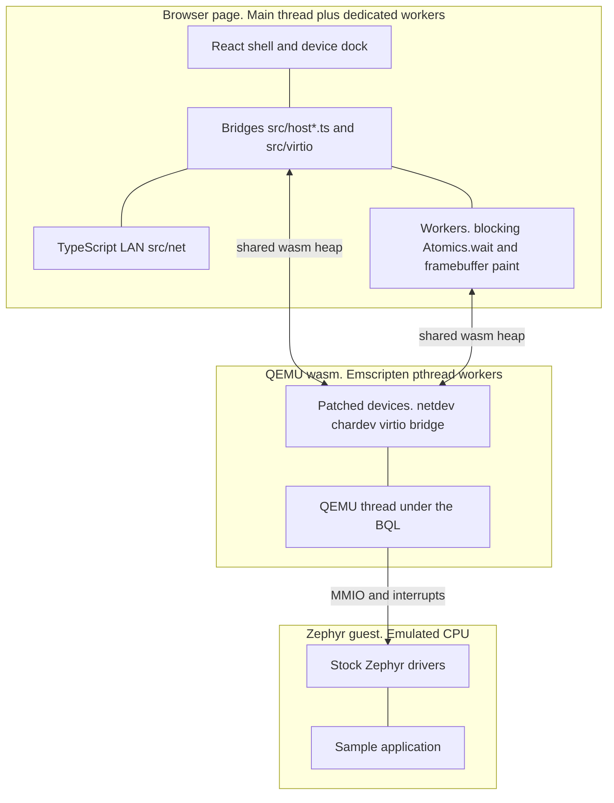
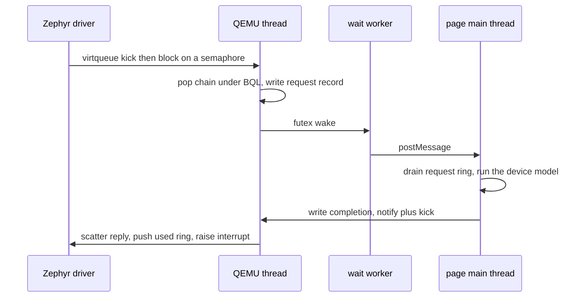
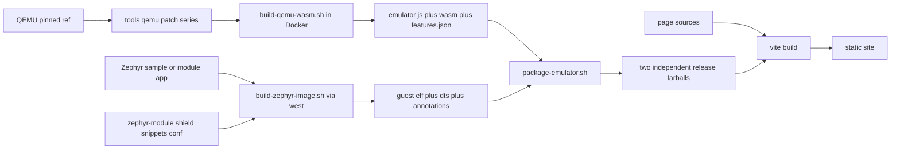

# Architecture

Zephyr in the Browser runs QEMU compiled to WebAssembly inside a page, boots an
unmodified Zephyr image on it, and makes the page itself the hardware on the
other end of every wire. The guest sees ordinary memory-mapped devices, buses
and a NIC, and binds stock Zephyr drivers to them; behind each of those devices
is TypeScript running in the tab, not silicon and not emulator C.

## The big picture

One organizing principle explains most of the codebase: QEMU C carries only what
must run on the QEMU thread under the big QEMU lock (popping virtqueue chains,
gathering iovecs, pushing the used ring, raising interrupts, driving chardev and
netdev frontends), and everything above that shared-memory ABI is TypeScript in
the page. A device model, a sensor, a NOR flash, the whole LAN: all of it lives
in `src/`, so adding behaviour is a file and a test rather than a containerised
emulator rebuild.

## How the page talks to the guest

Every peripheral picks one of a small set of transports across the wasm
boundary. `src/backends/qemu.ts` is the single place bridges are attached, and
each bridge duck-types the Emscripten module into a set of optional `_qemu_*`
exports it probes for.

| Mechanism | What crosses it | Representative use |
| --- | --- | --- |
| Exported C call | one scalar or byte per call | set a GPIO input mask, feed a GNSS byte |
| SPSC ring in the shared heap | length-prefixed frames, or fixed-width records and samples addressed by free-running indices | Ethernet frames, audio samples, pointer and wheel events |
| Browser chardev ring | a byte stream with a protocol above it | QMP monitor, gdb remote serial protocol |
| Generic virtio bridge | a virtqueue chain flattened into a request record | I2C, SPI and GPIO device models written in TypeScript |
| Shared framebuffer view | nothing is copied: pixels read in place plus an atomic dirty counter | display painted in a render worker |
| Emscripten MEMFS file | append-only bytes the guest writes over semihosting | CTF trace stream |
| PTY over SharedArrayBuffer | guest stdio | the terminal, and OSC records carrying sample annotations |
| Composition over another bridge | nothing crosses | seven-segment latching, stepper edges, buzzer |

The hard part is that a guest thread can block waiting for an answer from an
asynchronous page. The browser main thread may never call `Atomics.wait`, so a
dedicated worker does the blocking wait and forwards each wake by message, while
completions wake QEMU with `Atomics.notify` plus a kick export that schedules a
bottom half under the BQL. A representative virtio round trip:

Every fast path keeps a capability-probed timer fallback, so an emulator build
without the wake exports degrades to polling instead of failing. Answering is
optional and may be late: a model that holds a chain on purpose parks it, and
anything else left unanswered is failed by a watchdog, because a dropped request
is a guest thread blocked forever.

## Repository map

| Path | What it owns |
| --- | --- |
| `src/backends/` | The `PtyBackend` seam: a mock shell, the qemu-wasm loader, and the one place bridges attach |
| `src/host*.ts` | The page-side half of each peripheral: one transport each, published as a change-compared snapshot React reads through `useSyncExternalStore` |
| `src/virtio/` | The generic bridge runtime, its wire codec, the bus adapter models and every simulated chip |
| `src/net/` | The LAN itself: dependency-free codecs, a stateful stack, and services installed over its listen hooks |
| `src/can/` | The CAN bus itself, the `src/net/` idea applied to CAN: broadcast delivery, occupancy and page-side node presets |
| `src/display/` | The ramfb render worker and the renderers it shares with the main thread |
| `src/annotations/` | Guided samples: the OSC record codec, the walkthrough store and the xterm seam |
| `src/debug/`, `src/ctf/` | Debugger transports and pure ELF, DWARF and CTF model code |
| `src/dts/`, `src/deviceTopology.ts` | Parse the running build's devicetree and derive the dock's device inventory |
| `src/components/` | React shell, terminal, device dock rows and floating panels |
| `zephyr-module/` | Out-of-tree Zephyr module: the `browser_bridge` shield, snippets, conf fragments, drivers, guided apps |
| `tools/` | Build drivers, the QEMU patch series, and the sample manifest |
| `public/qemu/` | Where the built emulator and guest images land. Generated, not checked in apart from its README |

## Build pipeline

The emulator and the guest images are two separately pinned release tarballs, so
a guest-only or page-only change deploys with no emulator rebuild. The patch
series are applied to a pinned checkout on every run and never committed back,
so experiments belong in the patch, not in the working tree. CI typechecks and
runs the unit suites on every push, builds guest images on demand, and deploys by
downloading both tarballs and rebuilding the page; the emulator itself is built
locally in Docker.
`tools/samples.manifest` and `src/boards.ts` are held in lockstep by a test.

## Adding a device

Work down the decisions; each one names its touch point.

1. **Pick the transport.** A standard bus part (I2C, SPI, GPIO) goes on the
   generic virtio bridge and needs no emulator change. Streaming bytes reuse an
   existing chardev or netdev ring. A new MMIO block means a QEMU patch, which is
   the last resort and only for code that must hold the BQL.
2. **Choose the guest driver.** Prefer a stock in-tree Zephyr driver. If the
   driver is not upstream yet, vendor a pristine copy under upstream's exact
   Kconfig symbol and path so retiring it is a deletion. Project-specific names
   are only for devices that exist solely because of this project.
3. **Describe the hardware.** Add the node to the machine overlay under
   `zephyr-module/boards/shields/browser_bridge/`, disabled if it is optional,
   with a snippet under `zephyr-module/snippets/` to enable it and a paired
   `conf/` fragment for the Kconfig half. Then one line in
   `tools/samples.manifest` and one entry in `src/boards.ts`.
4. **Write the page-side model.** A chip on a bus satisfies the small `I2cChip`
   or `SpiChip` contract. Its file goes under `src/virtio/devices/` by class (for
   example `chips/`, `sensors/`, `rtc/`), an entry in `CHIP_TYPES` in
   `src/virtio/devices/registry.ts` (or `SPI_CHIP_TYPES` in `spiRegistry.ts`)
   makes it attachable from the bus panel and resolvable from the devicetree
   roster, and a board default needs one more line in `MANAGED_CHIPS` /
   `MANAGED_I2C_BY_TYPE` (or `MANAGED_SPI_BY_ID`) in `src/virtio/index.ts` so a
   persisted chip keeps its identity across attaches. A whole new bus, rather
   than a part on one, is a `VirtioDeviceModel` plus one `register()` line in
   `src/virtio/index.ts`, bound by its `name=` property. Register layouts belong
   in JSON maps beside the chip; only codecs are code.
5. **Give it a dock row.** Map the compatible in `src/dts/insights.ts` so the
   devicetree derivation finds it, and add its body to
   `src/components/dock/deviceBodies.tsx`. Rows and floating windows share that
   one registry, and a chip implementing the register-map shape gets the shared
   inspector for free.

## Invariants

- **Cross-origin isolation is a precondition, not a tuning knob.** The emulator
  is linked with pthreads and blocking stdin reads use `Atomics.wait` on a
  SharedArrayBuffer, so the QEMU backend refuses to start without it and the
  page falls back to the mock shell. `public/coi-serviceworker.js` re-serves the
  document with the headers on static hosts that cannot send them.
- **One emulator instance per document, forever.** Committing to a QEMU start
  taints the page: restart, board change or a new image is a navigation.
  Selection travels in the query string, guest bytes in IndexedDB.
- **Everything that can fail in a start is checked before the commit point,**
  which is what makes the fallback to the mock backend safe.
- **Device models are tested without the emulator.** Each one runs against a JS
  stand-in for the C side, so behaviour is a unit test rather than a boot.
- **All shared rings follow one discipline:** free-running `uint32` indices,
  exactly one writer per index word, records that never straddle the end, and
  payload copied out before the read index moves.
- **Every bridge is capability-probed and optional.** A missing export hides a
  panel; it never fails a boot, so a page pinned to an emulator without that
  export still boots.
- **The devicetree of the running build decides what exists.** The dock is
  derived from the flattened tree shipped beside the ELF, availability gates
  what is interactive rather than what is listed, and a missing or unparseable
  tree degrades to fallbacks without delaying the boot.
- **Guest images ship unstripped,** because the in-page debugger resolves
  threads and symbols out of the ELF itself.

## Where to read more

| Document | What it covers |
| --- | --- |
| [peripherals.md](peripherals.md) | How browser-fed devices reach the guest: the shield, the drivers, touch input |
| [virtio-bridge.md](virtio-bridge.md) | The generic bridge contract, ring layout and device model API |
| [networking.md](networking.md) | Why the page is the LAN, and what does and does not leave the tab |
| [sample-annotations.md](sample-annotations.md) | Samples that explain themselves, and stopping the machine to read them |
| [performance.md](performance.md) | Where the time goes, and the experiment that settles each question |
| [deploying.md](deploying.md) | Cutting a release and deploying the site |
| [../public/qemu/README.md](../public/qemu/README.md) | The emulator: how it is built, what is patched into it, its limits |
