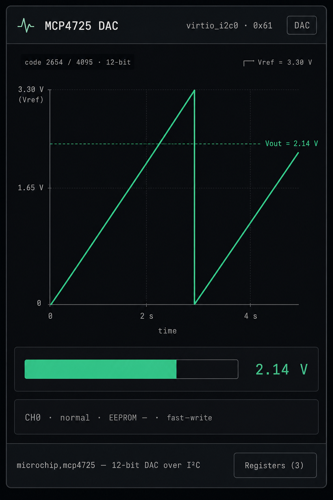

# Spec: DAC dock class + MCP4725

Next I²C peripheral after PCA9685. Opens a new dock class (**DAC**)
with a live **Vout** chart (sawtooth / level) as the hero of the card.

**Doctrine:** the chart and meter render a bus-agnostic {@link DacChip}
surface — same shape as `PwmChip` / RTC. MCP4725 is the first *provider*.
A later MCP4728 (multi-channel) or SoC DAC reuses `DacBody` unchanged;
only a declaration (and optional map) is new work.

## Dock card mockup



Hero is a **time-series of output voltage** (stock sample’s ~4 s sawtooth),
plus a large level bar, code/Vref readout, and Registers when the provider
exposes a map.

## Goals

| | |
| --- | --- |
| Framework | `src/virtio/devices/dac/model.ts` — `DacDecl` + `DacChip` + `isDacChip` |
| First provider | Microchip MCP4725 — `microchip,mcp4725` @ **0x61** |
| Sample | `samples/drivers/dac` (sawtooth via `dac_write_value`) |
| Dock class | new **`dac`** / “DAC” — one body for every provider |
| Map | Thin JSON under `chips/maps/` (shadows + status; see below) |
| Viz | Vout-over-time + level bar against `DacChip` — not MCP4725-specific UI |
| v1 chip | Single channel, VDD-referenced; EEPROM write modes optional |

**Address note.** Zephyr boards and Adafruit breakouts default to **0x60**,
but that address is already `pca9685@60` in our virtio-i2c catalog. Use
**0x61** (A0 strapped high) so both can stay declared. Document the delta
in the overlay comment.

**Why DAC before ADC.** Guest **writes** → page **shows** volts is a new
direction. ADC would be page **feeds** → guest **reads**, which sensors
already cover. See the peripherals ranking discussion that led here.

## Why a framework (not an MCP4725 panel)

| Layer | Owns | Touched when adding a 2nd DAC chip? |
| --- | --- | --- |
| `dac/model.ts` | `DacDecl`, `DacChannel`, `DacChip`, `isDacChip` | Only if a new optional capability is needed |
| `DacPanel.tsx` / `DacBody` | Trace, level bar, metrics, Registers | **No** |
| `deviceTopology` / insights | `deviceClass: 'dac'`, `body: 'dac'` | **No** — `isDacChip(chip)` |
| Provider (`mcp4725.ts`, later …) | Bus bytes, map, `decl`, history | **Yes** |
| Overlay / snippet / conf / sample | Guest binding | **Yes** |

Anti-patterns:

- `if (isMcp4725(chip))` inside the panel
- Hard-coded “12-bit” / “3.3 V” in the UI (come from `decl`)
- A second chart component for MCP4728

## Framework surface

### `DacDecl` — what varies per part

```ts
interface DacDecl {
  name: string
  /** Output channels (MCP4725: 1; MCP4728: 4). */
  channelCount: number
  /** Bits of code the guest writes (MCP4725: 12). */
  resolutionBits: number
  /**
   * Full-scale reference in millivolts. MCP4725 is VDD-referenced; default
   * 3300 for the page. Providers may expose a setter later; v1 is fixed.
   */
  vrefMv: number
  /** Optional metrics strip keys (MCP4725: mode, eeprom). */
  detailKeys?: readonly string[]
  /**
   * How much output history the chart keeps (ms of wall time). Default
   * ~5000 so one sawtooth period of the stock sample fits.
   */
  historyMs?: number
}
```

### `DacChannel` — what the chart needs

```ts
interface DacChannel {
  index: number
  /** Raw code 0 .. (1<<resolutionBits)-1 */
  code: number
  /** Engineering volts = code / maxCode * (vrefMv/1000). */
  volts: number
  /** Power-down / load mode when the part has one. */
  powerDown: 'normal' | '1k' | '100k' | '500k' | string
}
```

Helpers (panel / model, not provider-specific):

- `maxCode = (1 << resolutionBits) - 1`
- `formatVolts(v)`, `formatCode(code, bits)`

### History — why the framework owns it

The stock sample steps the code every 1 ms across 4096 values (~4 s period).
A static “current volts” badge is weak; the mockup’s sawtooth needs a ring
buffer of `(t, volts)` samples.

```ts
interface DacSample {
  /** performance.now() or chip-local ms when the code changed. */
  t: number
  channel: number
  volts: number
  code: number
}
```

`DacChip` exposes `getHistory(channel): readonly DacSample[]` (or the
framework helper `createDacHistory(decl)` that providers call from
`notify`). Panel draws the last `historyMs` window. **Do not** put the ring
only in MCP4725 — MCP4728 must reuse it.

### `DacChip` — what `DacBody` and topology duck-type

```ts
interface DacChip extends I2cChip {
  readonly decl: DacDecl
  readonly registers: readonly RegisterDecl[]  // empty → hide Registers
  peek?(addr: number): number
  getPointer?(): number
  poke?(addr: number, value: number): void
  setField?(...): void

  getChannel(index: number): DacChannel
  getHistory(channel: number): readonly DacSample[]
  getDetail?(key: string): string
  version(): number
  subscribe(fn: () => void): () => void
}

function isDacChip(chip: I2cChip | null | undefined): chip is DacChip
```

Topology: `if (isDacChip(chip)) return 'dac'` — no provider imports in
`deviceBodies` beyond `DacChip`.

### Adding a second DAC provider later

1. `createFooDac(): DacChip` with a `DacDecl`
2. Optional `maps/foo.json`
3. Registry + overlay + `*-only` + conf + manifest
4. **Stop.**

## First provider: MCP4725

### Hardware / driver facts

From Zephyr `drivers/dac/dac_mcp4725.c` and the datasheet:

| | |
| --- | --- |
| Channels | 1 → `decl.channelCount` |
| Resolution | 12-bit (0…4095) |
| Reference | VDD (page default 3.30 V) |
| Fast write | 2-byte I²C write, no register pointer: `{0, PD[1:0], D11..D8}, {D7..D0}` |
| EEPROM | Separate write commands; stock sample uses fast mode only |
| Read | 5-byte status + DAC + EEPROM (driver polls RDY on init) |
| Default board addr | 0x60 — **we use 0x61** |

`dac_write_value` packs the 12-bit code into the fast-write frame (PD = 0).

### Provider module

`chips/mcp4725.ts` (+ `maps/mcp4725.json`):

- Implements `DacChip` (`resolutionBits: 12`, `vrefMv: 3300`, `historyMs: 5000`)
- `write()` parses fast-write (and optionally EEPROM write commands)
- `read()` returns a plausible 5-byte status with RDY=1 so init succeeds
- Appends to history on every code change
- `getDetail('mode')` → `fast-write` / `eeprom`; `getDetail('eeprom')` → last stored code or `—`
- `isMcp4725` only for tests — not UI

### JSON register map (thin)

MCP4725 is closer to a **command stream** than a pointered file, but the
shared Registers affordance is still useful for shadows:

| Name | Addr (synthetic) | Meaning |
| --- | --- | --- |
| `DAC_CODE` | `0x00` | Last fast-write code (12-bit in low bits); poke → updates output |
| `STATUS` | `0x01` | RDY / POR / PD bits as last read |
| `EEPROM_CODE` | `0x02` | Last value written to NV memory (if any) |

Document that these addresses are **inspector shadows**, not datasheet
register numbers — same honesty SSD1306’s Controller has, but still a map
so poke works for demos.

## Dock UX — one body, any provider

### Hierarchy (one job)

1. **Trace** (hero) — `getHistory(selected)` over `historyMs`, Y = volts 0…Vref
2. **Level bar** — current `getChannel(selected).volts`
3. **Readout** — `code / max · N-bit`, `Vref`, `Vout`
4. **Channel strip** — only if `channelCount > 1` (hidden for MCP4725)
5. **Registers** — if `hasRegisterMap(chip)`

No input sliders that fight the guest. Guest drives the DAC; the card
*observes*. (Optional later: a “hold” poke from Registers only.)

### Trace anatomy (must show)

| Annotation | Meaning |
| --- | --- |
| Trace | Vout vs time (sawtooth for the stock sample) |
| Y ticks | `0`, mid, `Vref` |
| X ticks | `0` … `historyMs` (label in s) |
| Current guide | Horizontal dashed line at live Vout + label |
| Code chip | `code N / max · R-bit` |

When history is flat (no writes yet), show a horizontal line at the current
level and a muted “waiting for dac_write_value” hint.

### Motion

1. Trace redraws on `subscribe` (rAF coalesce; downsample history if huge)
2. Level bar width animates with code changes
3. Optional: soft flash on the readout when code changes — nice-to-have

## Topology / packaging (MCP4725)

| Piece | Value |
| --- | --- |
| `DeviceClass` / `BodyKind` / `PanelKind` | `'dac'` |
| `ChipKind` | `'dac'` |
| `CLASS_LABELS.dac` | `'DAC'` |
| Compat | `microchip,mcp4725` → insights panel `dac` |
| Registry | `id: 'mcp4725'`, defaultAddress `0x61` |
| Overlay | `mcp4725_0: mcp4725@61` disabled by default; `#io-channel-cells = <1>` |
| Snippet | `mcp4725-only` — enable chip; `/zephyr,user` dac props; disable default I²C clutter |
| Conf | `conf/mcp4725.conf` — `CONFIG_I2C`, `CONFIG_DAC`, `CONFIG_DAC_MCP4725`, stack bump |
| Sample id | `dac` → `samples/drivers/dac` |
| Boards | A53 + riscv32 |

### Devicetree shape (snippet)

```dts
&mcp4725_0 {
	status = "okay";
};

/ {
	zephyr,user {
		dac = <&mcp4725_0>;
		dac-channel-id = <0>;
		dac-resolution = <12>;
	};
};
```

Stock sample requires those three `/zephyr,user` properties (see
`samples/drivers/dac/src/main.c`).

## Out of scope (v1)

- Multi-channel MCP4728 (same framework, later provider)
- User-adjustable Vref slider (fixed 3.30 V unless Registers grows it)
- ADC class
- Using Adafruit’s 0x60 (conflicts with PCA9685)
- Driving a page-side “analog sink” into another chip

## Acceptance

- [ ] `DacBody` types only against `DacChip` / `DacDecl` (no MCP4725 imports
      in the panel except tests/previews)
- [ ] Guest `samples/drivers/dac` sawtooth is visible on the trace (~4 s)
- [ ] Level bar and `Vout` track `dac_write_value`
- [ ] Init `read` RDY path succeeds (driver `mcp4725_wait_until_ready`)
- [ ] Registers poke on `DAC_CODE` updates the chart
- [ ] Detach → guest write fails; reattach recovers
- [ ] `npm test` / `tsc`; manifest ↔ boards lockstep

## Implementation sketch

1. `dac/model.ts` — types, `isDacChip`, history helper, formatters
2. `chips/mcp4725.ts` + `maps/mcp4725.json` + unit tests (fast-write decode,
   RDY read, history append)
3. `DacPanel.tsx` — canvas trace + level bar against `DacChip` only
4. Topology / registry / insights / gallery (`dac`)
5. Overlay, `mcp4725-only`, conf, manifest, docs
6. Optional `?preview=dac`
