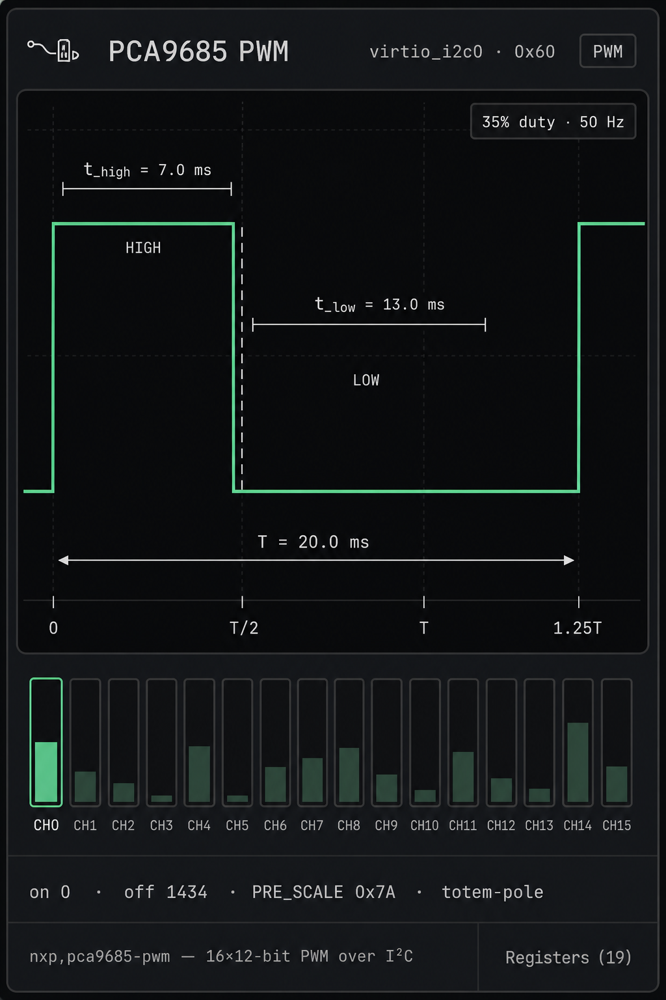

# Spec: PWM dock class + PCA9685

Next I²C peripheral after HT16K33. Opens a new dock class (**PWM**)
with an oscilloscope-style duty-cycle chart as the hero of the card.

**Doctrine:** the chart and strip render a bus-agnostic {@link PwmChip}
surface — the same shape sensors / memory / RTC already use. PCA9685 is
the first *provider*. A later LP50xx PWM path, `pwm-gpio`, or SoC timer
reuses `PwmBody` unchanged; only a declaration (and optional JSON map)
is new work.

## Dock card mockup



Hero is the **time-domain square wave** for the selected channel: slightly
more than one period (~1.25×), with period / high / low callouts, duty +
frequency chip, a channel duty strip sized from the declaration, and the
usual Registers affordance when the provider has a map.

## Goals

| | |
| --- | --- |
| Framework | `src/virtio/devices/pwm/model.ts` — `PwmDecl` + `PwmChip` + `isPwmChip` |
| First provider | NXP PCA9685 — `nxp,pca9685-pwm` @ **0x60** |
| Sample | `samples/drivers/led/pwm` (PWM-backed `pwm-leds`) |
| Dock class | new **`pwm`** / “PWM” — one body for every provider |
| Map | Provider-optional JSON under `chips/maps/` (PCA9685 ships one) |
| Viz | Duty-cycle chart against `PwmChip` — not PCA9685-specific UI |
| v1 chip | Output only; no OE pin, no external CLK, no ALLCALL |

**Address note.** Adafruit’s shield defaults to `0x40`, which is already
`ina219@40` in our virtio-i2c catalog. Two children with the same `reg` is
a mess even when one is disabled. Use **0x60** (A0–A5 strap / solder-bridge
story) so both parts can stay declared. Document the delta from Adafruit
in the overlay comment.

## Why a framework (not a PCA9685 panel)

Sensors, memory, and RTC already teach the rule: the dock keys off a
*class handle*, not a chip id. Adding LM75 did not mean a second temperature
card. PWM must land the same way on day one:

| Layer | Owns | Touched when adding a 2nd PWM chip? |
| --- | --- | --- |
| `pwm/model.ts` | `PwmDecl`, `PwmChannel`, `PwmChip`, `isPwmChip` | Only if the new part needs a new optional capability |
| `PwmPanel.tsx` / `PwmBody` | Waveform, strip, metrics, Registers | **No** — already reads the handle |
| `deviceTopology` / insights | `deviceClass: 'pwm'`, `body: 'pwm'` | **No** — `isPwmChip(chip)` |
| Provider (`pca9685.ts`, later …) | Bus bytes, map, `decl` | **Yes** — this is the work |
| Overlay / snippet / conf / sample | Guest binding | **Yes** — packaging only |

Anti-patterns to avoid:

- `if (isPca9685(chip))` inside the panel body
- Hard-coded “16 channels” or “PRE_SCALE” labels in the UI (those are
  metrics *slots* filled from the handle / optional detail rows)
- A second chart component for the next part

## Framework surface

### `PwmDecl` — what varies per part

```ts
interface PwmDecl {
  name: string
  /** Channels this controller exposes (PCA9685: 16; a tiny part might be 1–4). */
  channelCount: number
  /**
   * How period is shared. `controller` = one period for every channel
   * (PCA9685 PRE_SCALE). `per-channel` = each channel can have its own T
   * (typical SoC PWM). The chart always reads period from the *selected*
   * channel either way.
   */
  periodScope: 'controller' | 'per-channel'
  /**
   * Optional extra metric rows under the strip (monospace). Providers that
   * have nothing interesting leave this empty — the chart still works.
   * Examples for PCA9685: PRE_SCALE hex, drive mode ("totem-pole").
   */
  detailKeys?: readonly string[]
}
```

### `PwmChannel` — what the chart needs

Every provider projects each channel into the same decoded view. The UI
never opens LEDn_ON registers itself.

```ts
interface PwmChannel {
  /** 0 .. decl.channelCount-1 */
  index: number
  /** Duty 0..1; full-on → 1, full-off → 0. */
  duty: number
  /** Period of *this* channel’s output, nanoseconds. */
  periodNs: number
  /** High time, nanoseconds (0 .. periodNs). */
  pulseNs: number
  /** Sticky extremes (PCA9685 full-on/off bits; others may always be false). */
  fullOn: boolean
  fullOff: boolean
  /** Electrical polarity the guest last requested, if known. */
  inverted: boolean
}
```

Derived for display (panel-side helpers, not provider API):

- `tHigh = pulseNs`, `tLow = periodNs - pulseNs`, `f = 1e9 / periodNs`
- full-on / full-off → flat trace + badge, skip duty brackets

### `PwmChip` — what `PwmBody` and topology duck-type

```ts
interface PwmChip extends I2cChip {
  readonly decl: PwmDecl
  /** Empty when the provider has no named map (Registers button hides). */
  readonly registers: readonly RegisterDecl[]
  peek?(addr: number): number
  poke?(addr: number, value: number): void
  setField?(addr: number, field: Pick<FieldDecl, 'lsb' | 'msb'>, value: number): void

  getChannel(index: number): PwmChannel
  /** Optional controller-level details for the metrics strip. */
  getDetail?(key: string): string
  version(): number
  subscribe(fn: () => void): () => void
}

function isPwmChip(chip: I2cChip | null | undefined): chip is PwmChip
```

Same RTC doctrine: `extends I2cChip` because today’s providers ride
virtio-i2c; the *PWM-shaped* methods are what the card cares about. A
future non-I²C PWM can widen the handle the way RTC comments already allow.

Topology:

```ts
if (isPwmChip(chip)) return 'pwm'   // chipClass / chipBody / chipPanelKind
```

No `isPca9685` branch in `deviceTopology` or `deviceBodies`.

## First provider: PCA9685

### Hardware facts (driver-aligned)

From Zephyr `drivers/pwm/pwm_pca9685.c` and the datasheet:

| | |
| --- | --- |
| Channels | 16 → `decl.channelCount` |
| Resolution | 12-bit (4096 steps) |
| Internal OSC | 25 MHz |
| Output rate | ≈ 24 Hz … 1526 Hz via `PRE_SCALE` |
| Default PRE_SCALE | `0x1E` → ~200 Hz |
| Period scope | `controller` (one PRE_SCALE) |
| Per channel | `LEDn_ON_L/H`, `LEDn_OFF_L/H` (ON usually 0; OFF = duty) |
| Full on / off | bit 4 of ON_H / OFF_H |
| Details | `prescale`, `drive` (“totem-pole” / “open-drain”) |

Period in wall time:

```
f_PWM = 25 MHz / (4096 × (PRE_SCALE + 1))
T     = 1 / f_PWM
```

Duty (when not full-on/off):

```
duty = (OFF − ON) / 4096
```

(driver writes ON=0, OFF=round(pulse/period×4096))

### Provider module

`chips/pca9685.ts` (+ `maps/pca9685.json`):

- Implements `PwmChip` (`decl.channelCount: 16`, `periodScope: 'controller'`)
- I²C pointered register file (MODE1 `AI`); match `set_cycles` 5-byte bursts
  and PRE_SCALE SLEEP → write → wake → RESTART
- `getChannel(n)` decodes ON/OFF / full flags into `PwmChannel`
- `getDetail('prescale')` / `getDetail('drive')` for the metrics strip
- Optional `isPca9685` **only** for tests / attach pairing — not for UI

### JSON register map

- `MODE1` (0x00), `MODE2` (0x01)
- `LED0_ON_L` … `LED15_OFF_H` (0x06–0x45) — explicit byte registers
- `PRE_SCALE` (0xFE)

Skip ALL_LED_* and SUBADR* in v1.

## Dock UX — one body, any provider

### Hierarchy (one job)

1. **Waveform** (hero) — `getChannel(selected)` → ~1.25 periods
2. **Channel strip** — `decl.channelCount` mini bars (not hard-coded 16)
3. **Metrics** — ON/OFF-style counts only if the provider exposes them via
   details / channel fields the panel already knows (`fullOn`, etc.); plus
   `decl.detailKeys` → `getDetail`
4. **Registers** — if `hasRegisterMap(chip)`

No servo knobs, no RGB picker, no second chart. Guest drives outputs; the
card *reads* the handle.

### Waveform anatomy (must show)

| Annotation | Meaning |
| --- | --- |
| Trace | HIGH plateau then LOW; second rising edge so period isn’t ambiguous |
| `T = …` | Full period double-arrow (ms or µs, auto-scale) |
| `t_high = …` | Pulse width bracket |
| `t_low = …` | Remainder bracket (`T − t_high`) |
| `N% duty · F Hz` | Corner chip (derived from `PwmChannel`) |
| `HIGH` / `LOW` | Phase labels |
| Falling-edge guide | Vertical dashed line at end of pulse |
| X ticks | `0`, `T/2`, `T`, `1.25T` |

**Full-on / full-off:** flat HIGH or flat LOW + badge.  
**Inverted:** draw electrical output; `inv` in the metrics strip.

### Channel strip

- `decl.channelCount` equal columns; fill height = `duty`
- Selected: outline + `CH{n}`
- Collapsed badge: `CH{n} · {duty}%` or `{n} ch · {f} Hz`

### Motion (2–3 intentional)

1. Waveform redraws on `subscribe` (rAF coalesce)
2. Soft highlight on the strip cell that just changed
3. Optional phase cursor — nice-to-have, not v1-required

### Adding a second PWM provider later (checklist)

1. `createFooPwm({ … }): PwmChip` with a `PwmDecl`
2. Optional `maps/foo.json` if it is a register file
3. Registry + overlay node + `*-only` snippet + conf + manifest sample
4. **Stop.** No panel edits unless `PwmDecl` gained a new optional field

## Topology / packaging (PCA9685)

| Piece | Value |
| --- | --- |
| `DeviceClass` / `BodyKind` / `PanelKind` | `'pwm'` |
| `ChipKind` | `'pwm'` |
| `CLASS_LABELS.pwm` | `'PWM'` |
| Compat | `nxp,pca9685-pwm` → insights panel `pwm` |
| Registry | `id: 'pca9685'`, defaultAddress `0x60`, `kind: 'pwm'` |
| Overlay | `pca9685_0: pca9685@60` disabled by default |
| Snippet | `pca9685-only` — enable chip + `pwm-leds` children; disable default sensors/OLED/EEPROM/LCD/HT16K33 |
| Conf | `conf/pca9685.conf` — `CONFIG_I2C`, `CONFIG_PWM`, `CONFIG_PWM_PCA9685`, `CONFIG_LED`, `CONFIG_LED_PWM`, stack bump |
| Sample id | `pwm_led` → `samples/drivers/led/pwm` |
| Boards | A53 + riscv32 |

### Devicetree shape (snippet)

```dts
&pca9685_0 {
	status = "okay";
};

/ {
	pwmleds {
		compatible = "pwm-leds";
		/* Start with 4 channels — enough for the stock sample loop;
		 * chip still models all 16 in the page. */
		s_led0: s-led-0 {
			pwms = <&pca9685_0 0 PWM_MSEC(20) PWM_POLARITY_NORMAL>;
			label = "PWM LED 0";
		};
		/* … s-led-1 .. s-led-3 … */
	};
};
```

Stock sample binds `DT_COMPAT_GET_ANY_STATUS_OKAY(pwm_leds)` and walks
`led_on` / `led_set_brightness` / `led_blink` — same path as the Adafruit
shield doc (`--shield adafruit_pca9685`), just our address and bus.

## Out of scope (v1)

- Keyscan-style inputs, OE GPIO, external oscillator
- Servo-angle overlay (° ↔ pulse µs) — later mode on `PwmBody`, still
  declaration-gated (e.g. `decl.servoUsMin/Max`), not a new panel
- Declaring all 16 `pwm-leds` (four is enough for the sample; strip still
  shows `channelCount` from the chip)
- Moving INA219 off 0x40 / using Adafruit’s 0x40
- A second PWM provider in the same PR

## Acceptance

- [ ] `PwmBody` types only against `PwmChip` / `PwmDecl` (no PCA9685 imports
      in the panel except tests/previews)
- [ ] Guest `samples/drivers/led/pwm` fades / blinks; chart duty and `t_high` track
- [ ] Changing PRE_SCALE updates `T` and Hz via `getChannel` / period
- [ ] Channel strip length follows `decl.channelCount`
- [ ] Registers dialog edits LED counts and the chart follows
- [ ] Detach → guest LED API errors; reattach recovers
- [ ] `npm test` / `tsc` green; manifest ↔ boards lockstep

## Implementation sketch

1. `pwm/model.ts` — `PwmDecl`, `PwmChannel`, `PwmChip`, `isPwmChip` (+ tiny
   display helpers for T / duty labels)
2. `chips/pca9685.ts` + `maps/pca9685.json` + unit tests (PRE_SCALE math,
   `set_cycles` byte patterns, `getChannel` projection)
3. `PwmPanel.tsx` — canvas waveform + strip against `PwmChip` only
4. Topology / registry / insights / gallery wiring (`pwm` + `isPwmChip`)
5. Overlay, `pca9685-only`, conf, manifest, docs (`peripherals.md` lists
   PWM alongside sensors / memory / RTC frameworks)
6. Preview route optional (`?preview=pwm`)
