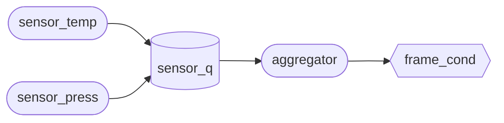

# Guided tours

A **tour** is a Markdown file that teaches a sample by stopping it. Each step
names a place in the running guest, and when execution reaches it the page
freezes the machine and puts a card on screen: the prose, plus whatever the
step asked to read out of the target — values, a window of memory with the
interesting bytes lit, registers, the kernel's thread list.

The sample being taught is **stock upstream Zephyr**. Nothing is added to it,
no Kconfig is turned on, and the image is byte-for-byte the one that ships
without a tour. A tour is a file the browser reads; the guest never knows.

`tours/blinky.tour.md`, `tours/basic_button.tour.md`,
`tours/philosophers.tour.md`, and `tours/msg_queue.tour.md` are the worked
examples, and being ordinary Markdown they read as articles about those samples
whether or not you ever run them.

## Writing one

Create `tours/<sample-id>.tour.md`, where `<sample-id>` is the app id from
`src/boards.ts`. That is the app's default tour; a sample can host more, as
`tours/<sample-id>.<slug>.tour.md` (see
[Several tours per sample, and links into one](#several-tours-per-sample-and-links-into-one)).
Front matter names the tour; each `##` heading starts a step;
a fenced ` ```tour ` block under the heading holds the stage directions; the
rest of the section is the prose.

Front-matter keys: `tour` (title), `sample` (Zephyr sample path), and optional
`source: no` to hide guest source / DTS excerpts on the card (breakpoints from
`at:` still plant; use this for page-orientation tours). Optional `next` names
the tour to offer at the end; see
[Ending a tour](#ending-a-tour-outro-and-next). Optional `sources:` lists
Zephyr files outside the sample whose code the card should be able to show;
see [Stops outside the sample](#stops-outside-the-sample-sources).

````markdown
---
tour: Blinky, explained
sample: samples/basic/blinky
---

Optional introduction.

## The numbers devicetree chose, arriving at the driver

```tour
at: gpio_virtio_pin_configure | qhg_pin_configure
panel: gpio
watch:
  - controller = *$arg0 as string
  - pin = $arg1 as dec
memory:
  at: $arg0
  len: 32
  mark: 2p..3p
  note: api — the driver's function table
```

The pin the source would not tell you is right there in the second argument
register…
````

The text between the front matter and the first `##` is the tour's
**introduction**: what the sample does, and what this tour is about. It goes
on the first card a reader sees, under the tour's title and above that step's
own prose, so the step can start at its stop instead of setting the scene. That
is step 1, or the step a [`?step=` link](#several-tours-per-sample-and-links-into-one)
starts at.

Dropping the file in is the whole wiring. Tours are picked up by an
`import.meta.glob`, so the gallery badge, the loader and the tests all discover
them from the directory — there is no list to keep in step. `npm run test`
parses every tour and fails on an authoring mistake.

**Tours ship with the page, not with the guest images.** That matters: the
images are a ~100 MB containerised Zephyr build published as a release asset and
pinned by a repository variable, so a tour bundled with *them* could not appear
until somebody rebuilt Zephyr. A tour is Markdown in this repository, it is in
the JS bundle, and a sample that has one always has one.

The directive block is a strict subset of YAML — `key: value`, `- item` lists,
one level of nested mapping. Anything the parser accepts, a real YAML parser
reads the same way, with one exception: a ` #` inside a `/pattern/` is part of
the pattern, where YAML would start a comment. Quote the value if a YAML tool
has to agree.

The prose is Markdown. HTML comments (`<!-- ... -->`) in it are notes for the
next author, and the card hides them the way GitHub does. Inside inline code or
a fenced block a comment is what the prose is quoting, so it shows.

Every key in the block must be one the parser knows. A misspelt `wacth:` fails
`npm run test` instead of leaving a card quietly short of its values. A key for
a directive still on its way can be reserved, accepted and ignored until it
lands (none is, today); the lists are `IMPLEMENTED_KEYS` and `RESERVED_KEYS` in
`src/tours/parse.ts`.

## Where a step breaks — `at:`

| Spelling | Means |
| --- | --- |
| `main.c:/toggle_dt/` | the first line of `main.c` matching the pattern |
| `main.c:blink/toggle_dt/` | the first line matching it inside `blink()` |
| `main.c:31` | line 31 of `main.c` |
| `gpio_pin_configure` | that function, past its prologue |
| `main+0x1c` | that function, at an offset |
| `0x40001234` | that address |
| `a \| b` | try `a`, fall back to `b` |

**Prefer the pattern form.** These samples track Zephyr `main`, so a line number
is a fact about a moment in somebody else's git history; `/toggle_dt/` still
means what it meant. (CodeTour learnt the same lesson and grew the same
feature.)

A pattern stops at the first line that matches it, and a sample can have the
same line in two functions: the sensor pipeline calls `BUS_UNLOCK();` in the
aggregator and in the storage thread. Name the function between the file and
the pattern, `main.c:storage_entry/BUS_UNLOCK/`, and only the body of
`storage_entry()` is searched. That stays right when upstream reorders the
file, where a longer pattern made to match once might not, and it tells the
next author which thread the step stops in.

All six are resolved against the ELF the page already fetched to boot the
guest: `.symtab` for symbols, `.debug_line` for source lines. Zephyr builds
with debug info, so the mapping is simply *there* — nothing is generated and
nothing is prepared. That also means a tour can break in code it does not own:
`at: z_impl_k_sleep` stops inside the kernel, and the sample never knows. The
card shows the code there only if the image carries it, which takes a line in
the front matter (`sources:`, below).

A line anchor lands on the first code **at or after** the line, the same as
gdb's `break file:n`, because an optimised build has no code for a comment or a
folded branch. The card shows where it actually landed.

A pattern has one weakness the other spellings do not: searching source text
needs the source text, and *that* does arrive with the guest images. An image
tarball older than the tour has no `src/<app>/`, and every pattern anchor in the
tour fails. So give each one a fallback:

```yaml
at: main.c:/gpio_pin_toggle_dt/ | main.c:38
```

Alternatives are tried in order. The pattern survives upstream editing the file;
the line number survives an image build that predates the tour. Each covers the
other's failure, and a test insists every pattern anchor in a shipped tour has
one.

An anchor that does not resolve costs one step, not the tour. The rest still
run, the reason appears on the card, and a tour where *nothing* resolved says so
in the console rather than looking like a sample with no tour.

### Lines that anchor well

An anchor resolves to **one** address: the lowest one the line table has for
that line. Two kinds of line have code in more than one place, and the step
stops in only one of them.

**Anchor on a plain statement, not a `LOG_*()` line.** One `LOG_INF()` expands
to a level check, a call and the argument handling around it, which the compiler
interleaves with its neighbours: about ten separate code ranges for one source
line. The breakpoint goes on one of them, which is not necessarily the one that
runs when you expect. An assignment or a call on a neighbouring line anchors
cleanly.

**A line inlined into several callers stops in only one of them.** The compiler
copies a small `static` function into each caller, and every copy claims the
same source lines. In a sample you control, mark the function `__noinline` so
there is one copy at one address. Otherwise anchor one level down, in a function
the inlined code calls (a kernel call such as `z_impl_k_msgq_put`): it has one
address whichever copy called it.

## Stops outside the sample: `sources:`

For a toured sample, the image build ships the sample's own `src/` beside the
ELF and nothing else, so a stop in `z_impl_k_msgq_put` resolves and stops, but
the card has no code to show for it. A tour that teaches the kernel names the
files it needs:

```markdown
---
tour: Message queues
sample: samples/kernel/msg_queue
sources:
  - kernel/msg_q.c
---
```

Each entry is a path in the Zephyr tree. `tools/build-zephyr-image.sh` copies
it verbatim, license header and all, to `src/<app>/zephyr/<path>` beside the
sample's own files, and writes `src/<app>/index.json` naming every file it
shipped. A path starting `zephyr-module/` names one of this repository's own
files instead. Absolute paths and `..` are refused, by the parser and the build
alike.

With the file shipped, everything that works in the sample's sources works in
it too, pattern anchors and highlights included:

```yaml
at: msg_q.c:/memcpy\(msgq->write_ptr/ | z_impl_k_msgq_put
highlight: /pending_thread = z_unpend_first_thread_locked/ + 8
```

A stop knows its file only as the path DWARF recorded on whatever machine built
the image: `/workdir/zephyr/kernel/msg_q.c` in the container, a home directory
on a laptop. The page matches it to the shipped file that shares the longest
tail with it, and the card says whose code it is: `Zephyr kernel ·
kernel/msg_q.c`, `this sample · main.c`, or `this page's module · …`.

Images built before `sources:` existed carry no `index.json`. On those a stop
outside the sample shows no code, a pattern in a kernel file falls through to
its next alternative, and the sample's own files work as they always have. So
give a kernel pattern a fallback, like any other.

## When it fires — `when:` and friends

| Key | Default | Means |
| --- | --- | --- |
| `when:` | every hit | `first`, `hits == 4`, `hits >= 3`, `hits % 10 == 0`, a state predicate, or a list |
| `repeat:` | `no` | keep the breakpoint after the step has fired |
| `stop:` | `yes` | `no` shows the card and lets the machine run on |

`when:` is DAP's `hitCondition`, spelt out. Hits are counted **in the browser**:
the breakpoint traps on every pass, and the ones that do not match are let go
again. No `SAMPLE_ONCE()` is compiled into the guest, and the sample has no idea
any of it is happening.

**A rejected hit is not free, only cheap.** It costs one register read, a
single step off the breakpoint and a continue, plus whatever memory its
[state predicates](#state-predicates) read. The machine never publishes a
pause, so nothing else runs: no memory peek, no thread walk, no stack unwind, no
card. That is a few milliseconds plus
the stub's poll interval, which is fine at blinky's one-blink-a-second and not
fine on something taking a mutex thirty times a second.

So match the condition to the rate:

- **Cold breakpoint** (once a second, a few times a run): `hits % 10 == 0` with
  `repeat: yes` is comfortable, and the card can come back round after round.
- **Hot breakpoint** (a kernel entry point, anything in an inner loop): use
  `hits == N`. It fires once and the breakpoint is lifted, so the cost stops
  there. A `repeat:` step on a hot address keeps trapping for the rest of the
  run, and the guest will feel it.

Two steps may share an address — "the line that does the work" and "the same
line, ten passes later" are both about blinky's toggle. Each counts its own
hits; the first whose condition fires is the one shown. Two *consecutive* steps
may share one too: the second waits for the guest's next pass, not the stop the
first one is sitting on.

A hit is one pass of the guest over the address. Neither QEMU's stub nor
OpenOCD lets a plain continue past a breakpoint at the PC (it traps again
without executing anything), so the debugger does what gdb does: it steps one
instruction with the breakpoint still in, then continues. A rejected hit and
the reader's Continue both go through that, which is what keeps a re-trap from
counting as a second pass.

### State predicates

A kernel function serves every caller in the system. `z_impl_k_msgq_put` runs
for the sample's queue, for the input subsystem's, for a timer handler posting
from an interrupt, and `hits == 3` counts all of them. A state predicate says
which calls the step is about:

```yaml
at: z_impl_k_msgq_put
when:
  - $arg0 == readings
  - _kernel as u32 == 0
  - hits == 3
```

A predicate is one comparison in the grammar of
[`check:`](#checking-the-guest-check-pass-fail-and-retry): a side with a format
is read, the way `watch:` reads it, and a side without one is the number the
expression is. So `$arg0 == readings` compares the first argument with the
address of `readings` and reads nothing, and `_kernel as u32 == 0` reads the
first word of `_kernel`, CPU 0's interrupt nesting count: "not in an ISR".

A list means all of it. Predicates are checked first, and a hit where one is
false is **not counted**, so `hits == 3` above is the third put to `readings`
from a thread, however many other puts went by in between. A predicate whose
side cannot be read at that stop does not hold either. `hits` compared with a
number is always the hit count; a guest variable that happens to be called
`hits` needs a format (`hits as u32 == 3`).

A [member view](#watch) reads a struct's field wherever the build put it, which
is often what a predicate is about:

```yaml
at: z_impl_k_msgq_put
when: k_msgq(readings).used_msgs as u32 == 7
```

The symbols and members a predicate names are facts about the build, so they
are checked once, when the tour arms, like an anchor. A step whose predicate
names something this build does not have is skipped and says why, rather than
waiting for ever on a hit that can never count.

**Each rejected hit pays for its predicates.** The guest is frozen at the stop
until they answer, and every side with a format is one more round-trip to the
stub (a pointer chase like `*p as u32` is two). Registers, symbols and numbers
cost nothing: they are already in hand. Predicates are checked in the order
written and stop at the first that is false, so lead with the one that turns
most hits away, and with the free ones before the reads:

- **Cold breakpoint**: anything goes. A few reads on a stop that comes once a
  second is nothing anyone will notice.
- **Hot breakpoint**: lead with a register comparison like
  `$arg0 == readings`, which rejects most callers before anything is read; keep
  the reads to one or two; and end on `hits == N`, which lifts the breakpoint
  once the step fires. A `repeat:` step with predicates on a hot address pays
  its reads on every pass for the rest of the run.

## What the card shows

Everything below is optional, and a step with none of it is just prose.

### `look:` and `panel:`

`panel:` names a row of the device dock: a `PanelKind` from `src/boards.ts`
(`gpio`, `led`, `i2c`, `net`, …), or one of the instruments, `trace`, `debug`
and `perf` (Simulation). The dock unhides that row, expands it and blinks it,
so the reader's eye has somewhere to go when the machine stops.

`look:` goes one level further in, to a tab of Trace or a section of Debug. A
step about a queue filling up wants the Queues tab, and a reader left on the
Timeline would not know that is where to look.

```yaml
look: trace.queues
```

```yaml
look:
  - trace.timeline
  - debug.objects
```

| Target | Opens |
| --- | --- |
| `trace.timeline`, `trace.queues`, `trace.net`, `trace.power` | that Trace tab |
| `debug.breakpoints`, `debug.cpu`, `debug.stack`, `debug.memory`, `debug.threads`, `debug.objects` | that Debug section |
| `dock.<panel>` | a dock row, the same as `panel:` |

Targets open in the order written, after `panel:`. A target or panel kind the
page does not know fails the test, rather than making a step that opens
nothing.

Only the traced build of a sample has Trace: the `· traced` twin in the
gallery, `<app>_trace`. Both builds read the same tour, so on the plain one a
Trace target opens nothing, and the card says so in one muted line: "This view
needs the traced build of this sample."

### `watch:`

A list of `label = expression as format` rows, read at the stop.

```yaml
watch:
  - controller = *$arg0 as string
  - owner = $arg0+2p as ptr
  - stopped in = $pc as code
```

One rule holds the expression language together: **an expression names a place,
and the format says how to read what is there.**

| | |
| --- | --- |
| `_kernel` | where the symbol lives (data symbols first, then functions) |
| `_kernel+8`, `_kernel-4` | address arithmetic |
| `$arg0+2p` | `p` is one pointer width — 4 bytes on Cortex-M3 and RISC-V, 8 on Cortex-A53 |
| `*$arg0` | follow the pointer stored there |
| `**$arg0` | …twice |
| `$pc`, `$sp`, `$x0`, `$a0` | a register |
| `$arg0`…`$arg3` | the ABI's argument registers, whichever this guest uses |
| `k_msgq(readings).used_msgs` | a struct member, at the offset the build's DWARF gives |
| `0x40001000` | a literal |
| `(…)` | grouping |

`1p` exists because a struct's second field does not start at the same offset on
a 32- and a 64-bit guest, and the same tour runs on all three boards.

Counting pointers stops working past the first field whose size is not one, and
Kconfig moves fields about anyway. A **member view** names the field instead:
`k_msgq(readings).used_msgs` is where `used_msgs` lives in the `struct k_msgq`
at `readings`, at the offset the build's own DWARF gives. That is 64 bytes in
on Cortex-A53, and 32 or 36 on a 32-bit board depending on its configuration.
The address in the parentheses is any expression (`k_msgq($arg0).used_msgs`,
`k_msgq(*p).max_msgs`). Use the struct's own name (`k_msgq` for
`struct k_msgq`, not a typedef) and its own members, not ones inside an
anonymous union. One member per view: a member of a member is a view of a view,
`_thread_base(k_thread($arg0).base).pended_on`. A member the build does not
describe reads as "no member", like a symbol it lacks.

`$arg0`…`$arg3` are only trustworthy at a function's first line — break on
`z_impl_k_mutex_lock` and the mutex is right there; break ten lines in and the
compiler has long since reused the register.

Formats that name a C type **read** at the address; `addr`, `code` and `dec`
render the address itself:

| Format | Shows |
| --- | --- |
| `u8` `u16` `u32` `u64` `i8`…`i64` | the integer there, in decimal and hex |
| `bool`, `char` | one byte, as a flag or a character |
| `string` | the NUL-terminated string there |
| `ptr` | the pointer there, with the symbol it points at |
| `bytes:N` | N bytes as an inline hexdump |
| `addr` | the address itself, symbolised |
| `code` | the address as `function+offset` |
| `dec` | the value itself, in decimal and hex |

Symbolised means the hex comes with the variable or function the address falls
inside, so `$sp as addr` at an interrupt reads
`0x40a1f7c0 · z_interrupt_stacks+0x7c0`, and a `ptr` holding a callback names
the function.

The default is `u32`. Nothing here but the member view needs type information,
and that only takes an offset from the DWARF every Zephyr build carries, which
is exactly why it works against a build nobody prepared: `*$arg0 as string`
walks device → name without knowing what either struct looks like.

`dec` is for the half of an ABI's arguments that are not addresses at all — a
stack size, a pin number, a bitmask. `$arg2 as u32` on one of those goes looking
for memory *at* 2048 and reports a thread's stack size as "unreadable".

A read that fails is a value, not an error: a null pointer this early in boot is
something the reader wants to see on the card.

Optimised builds are why an expression should prefer a register to a symbol
where it can. `-O2` folds a `static const` the sample only ever passes to inline
accessors clean out of existence — blinky's `led` has a DWARF entry with no
location and no `.symtab` address at all — so `led+1p as u8` can only ever say
"no symbol `led`". Break where the pin *arrives* instead: the driver's
`pin_configure` is handed it in `$arg1`, and no optimiser can take that away.

### `memory:`

Opens a hexdump of guest memory inside the card, with a byte range picked out.

```yaml
memory:
  at: $arg0
  len: 32
  mark: 2p..3p
  note: owner — the thread currently holding this fork
```

`at:` is an address expression. `mark:` is a `start..end` range of offsets from
it, end-exclusive, and both ends are expressions too — so `2p..3p` means the
third pointer-sized field whatever the word size is. The card offers to hand the
same address to **Debug → Mem**, where it can be scrolled, searched and edited.

### `highlight:`

Where the machine stops and what the step is *about* are different questions,
and `highlight:` answers the second:

```yaml
at: main
highlight: /GPIO_DT_SPEC_GET/
```

That step stops on the first statement of `main()` and points at a declaration
twenty lines earlier which has already run. In the excerpt the stop line carries
a `▸` in the gutter and the highlight is tinted, so the two never get confused.

| Entry | Means |
| --- | --- |
| `21` | line 21 |
| `21-24` | lines 21 to 24, inclusive |
| `/pattern/` | the first line matching |
| `/pattern/ + 3` | that line and the three after it |

Several are allowed:

```yaml
highlight:
  - /gpio_is_ready_dt/ + 2
  - /gpio_pin_configure_dt/ + 3
```

On one line they are separated by commas (`highlight: 21, /toggle/ + 1`). A
comma inside a `/pattern/` belongs to it, so `/k_msgq_put\(&q, &data/` is one
entry.

Line numbers are in the shipped source; patterns are searched in the same text
an `at:` pattern uses, so a highlight and the code under it cannot disagree. A
pattern that matches nothing is dropped rather than guessed at — a highlight
over the wrong lines is worse than none. The excerpt grows to cover whatever is
marked, up to 40 lines. When the stop and the highlight are too far apart for
one window, each gets its own few lines of context and the lines between them
fold into a single `⋯` row, so the line the machine stopped on stays in view.

### `dts:`

Same spelling as `highlight:`, but against the running guest's **devicetree**
rather than the file `at:` stopped in. A step can pause on
`gpio_pin_configure_dt()` and point at the `led0` node that named the pin:

```yaml
at: main.c:/gpio_pin_configure_dt/ | main.c:32
highlight: /GPIO_DT_SPEC_GET/
dts: /led0: led_0/ + 3
```

The card shows a second excerpt, labelled with the `.dts` file name. Absence
(a user ELF with no tree) is silent: the prose still stands.

### `objects:`

The kernel objects that exist at this stop, and what state they are in.

```yaml
objects: mutex          # one type
objects: sem, mutex     # several
objects: all            # everything this guest registered
objects:                # …and which one the step is about
  type: mutex
  focus: $arg0
```

`CONFIG_OBJ_CORE` keeps every mutex, semaphore, message queue, mailbox, slab and
thread in a per-type inventory, so this needs no addresses and no offsets: the
object cores say what exists, and the build's own DWARF says how to read each
one. A `mutex` row shows its owner, lock depth and the owner's base priority; a
`sem` row shows count and limit; a `msgq` row shows used and capacity.

`focus:` is an address expression, and the object at that address is picked out
of the list — `focus: $arg0` on `z_impl_k_mutex_lock` lights up the one this
caller is asking for, next to the five it is not.

Type names are the ones a person would write; Zephyr's four-letter codes
(`MUTX`, `SEM4`) work too, and an unrecognised one fails the test rather than
rendering as an empty list. Clicking a row opens Debug → Objects.

#### A message queue as a ring: `view: ring`

A step about one message queue draws it as the ring buffer it is:

```yaml
at: main.c:/urgent_data\+\+/ | main.c:37
objects:
  type: msgq
  focus: my_msgq
  view: ring
```

Every slot of the queue's buffer is on the card. A slot holding a message is
shaded and numbered in the order it will be read (1 is next), with the
message's first bytes in hex, and the character too when messages are one byte
long. **R** sits over the slot `read_ptr` points at and **W** over the one
`write_ptr` points at, so `k_msgq_put_front()` stepping R back round to the
last slot is something the reader sees rather than works out. When R and W
share a slot, the kernel's `used_msgs` is what tells a full queue from an empty
one. Under the strip, "3 of 10 used, 1 byte per message" says what the plain
row would have.

The ring is the default whenever a block names `type: msgq` and a `focus:`;
`view: list` keeps the plain row. Asking for a ring without both is an
authoring error, since there is no one queue to draw.

Unlike the rest of `objects:`, the ring is read at the stop, the queue's struct
and then its buffer, the same way `memory:` reads its bytes: where R and W sit
*at this step* is the lesson, and the object walk lands a beat too late to say.
So a step read again from the outline shows the ring as it was, and **Step**
on the card does not move it. The image's DWARF has to name the queue's
members, and the queue has to fit on a card (64 slots); otherwise the card
keeps the plain row. At most 1024 bytes of a buffer are read, and a slot past
that is drawn without its bytes.

### `registers:` and `threads:`

```yaml
registers: pc, sp, x0
threads: yes
```

`registers:` spotlights those registers on the card (clicking one opens
Debug → CPU). `threads:` shows the object-core thread list at this stop —
states, priorities, stack use — using `CONFIG_OBJ_CORE` plus
`CONFIG_DEBUG_THREAD_INFO`, both on in every packaged image.

A step about two or three threads can name them instead of `yes`, so the
others do not push the code down the card:

```yaml
threads: aggregator, consumer*
```

`*` matches any run of characters. The list header says how many of the
guest's threads it shows, and a name that matches no thread at the stop is
listed under it, so a thread upstream renamed shows up as a slip rather than
quietly going missing. A thread that names itself with `k_thread_name_set()`
has its `K_THREAD_DEFINE` name until it runs that line: in the sensor pipeline,
`consumer*` matches `consumer0_thread` before it matches `consumer0`.

Both of these read the debugger's live walk rather than a copy taken when the
card was built, because the walk lands a beat after the registers do. On a busy
stop they fill in a moment after the prose.

Which is also why neither works on a `stop: no` step, and why asking for one
there is an authoring error rather than a slow card: `watch:` and `memory:` are
read while the machine is still halted, but the walks are dozens of round-trips
that have not finished by the time the guest is let go, and what is left on the
card is a spinner nothing will resolve.

### Shell snippets

A fenced `shell` block in a step's prose is a command the reader can run. The
card shows it with **Run** and **Copy**:

````markdown
Stop the consumer, then watch the queue fill:

```shell
msgq consumer suspend
```
````

**Run** types each line into the terminal followed by Enter, about 150 ms
apart, exactly as if the reader had typed it: the shell echoes it and keeps it
in its history. Blank lines and `#` comments are skipped, because the Zephyr
shell has no comments and would answer one with "command not found". **Copy**
puts the block on the clipboard as the card shows it.

On a paused card the button reads **Continue and run**. A halted guest's shell
cannot answer, so the button does what Continue does, waits for the debugger to
report the guest running, then waits for the shell's prompt (the cursor right
after a `$ `, as in `uart:~$ `) before it types. The prompt matters on a card
paused early in boot: Zephyr's shell throws away anything that arrives before
it has started (`shell_start()` flushes its receive buffer), and the prompt is
the first thing it prints once it has. Both waits give up after a few seconds
and type anyway. Continue plants the next step's breakpoint before it resumes,
as always, so a step that fires before the shell has read the command holds it
until the reader continues again.

A command often needs something only the running guest knows. Two placeholders
fill it in:

| Placeholder | Becomes |
| --- | --- |
| `${thread:NAME}` | the address of the thread with that name, as `0x…` |
| `${addr:SYMBOL}` | the address of that data symbol |

```shell
kernel thread suspend ${thread:consumer}
```

`thread:` looks the name up in the debugger's last thread walk, then falls back
to the `_k_thread_obj_NAME` symbol that `K_THREAD_DEFINE()` leaves in the image,
so a statically defined thread resolves before the guest has stopped once.
Neither reads guest memory, which is why both work while the guest runs. The
card shows the value it filled in, with the placeholder in a tooltip.

A placeholder that does not resolve (no such thread, no such symbol, or no
guest at all on the mock backend) disables Run, and the card says why. A
malformed one, such as an unknown kind or a missing name or brace, is an
authoring error, and `npm test` fails on it.

Only `shell` blocks run. Docs show terminal sessions as `console` and `sh`,
prompts and output included, so those stay ordinary code blocks and nothing
pasted from a transcript becomes runnable by accident. Markdown outside a tour
card never runs either. On the mock backend Run types into the demo shell, so a
tour's snippets can be tried on a bare checkout.

### Diagrams: ` ```mermaid `

A fenced `mermaid` block in a tour's prose, a step's or the introduction's, is
drawn as a diagram, where it stands in the prose. It is for the map a reader
needs before the stops make sense: which threads there are, and which kernel
objects connect them. What the guest is doing at a stop is better shown live,
with `threads:`, `objects:` and Trace.

````markdown
Three sensors pass readings to the aggregator through `sensor_q`.


````

Two classes come with the page, styled for light and dark: `focus`, what the
step is about, and `dim`, the rest, which stays in view but quiet. An edge that
touches a `dim` node is dimmed with it, so there is no `linkStyle` to count.
Any other class needs its own `classDef`, in fixed colours. `npm test` parses
every diagram in `tours/`, and fails on one Mermaid cannot parse or on a class
nothing defines.

Mermaid is large, about 200 KB gzipped to draw a flowchart, so the page imports
it the first time a card has a diagram, and never otherwise. The diagram takes
the page's colour tokens and monospace font, and is drawn again when the system
switches between light and dark. A diagram that cannot be drawn shows its
source, with Mermaid's error under it.

GitHub draws the same block, so a tour read as an article there keeps its map,
in Mermaid's default colours and without `focus` and `dim`.

One map per tour is plenty, in the introduction: it is on the first card, a
card is narrow, and a diagram in a later step pushes that step's values further
down. The sensor pipeline tours share one map and each picks out its own part
of it.

## The learner's turn (`await:` and `do:`)

Some steps cannot be reached by pressing Continue. The guest only gets there
once the reader does something: presses SW0, types a shell command. `await:`
says what, in one line of Markdown:

```yaml
at: button_input_cb | main.c:/static void button_input_cb/ | main.c:20
await: Press **SW0** in **GPIO Keys**.
```

When the card before is dismissed and this is the step the tour now waits on,
a compact **Your turn** card shows that line. It pauses nothing: the guest
runs, the reader acts, and the step's own card replaces it when the guest gets
there. A first step with `await:` shows its card from the start, and **Leave
the tour** works from it as from any card.

The your-turn card also opens what the step points at, its `panel:` and
`look:`. A step that says "watch the queue fill" wants the Queues tab open
while the queue fills, not once it has. On a build without Trace it carries the
same one-line note as the step card.

`do:` adds shell lines for the reader to type, in order. They show under the
`await:` line as one block with a Copy button:

```yaml
at: cmd_kernel_uptime
await: Ask the kernel how long it has been running.
do:
  - kernel uptime
```

A single line can be written inline (`do: kernel uptime`), and unlike other
inline values it is never split on commas. `do:` without `await:` is an
authoring error, because the lines only ever appear on the your-turn card.

## Checking the guest (`check:`, `pass:`, `fail:` and `retry:`)

A step can say what should be true when it fires, and the card says whether it
was. That is how a challenge tells the reader their fix worked, and how prose
can state a fact about the guest safely: the engine checks it.

```yaml
at: main.c:/alarm_in_isr = / | raise_alarm
await: Pick a policy, then press **SW0** again while the queue is full.
do:
  - msgq policy drop-oldest
check:
  - alarms_lost as u32 == 1
  - alarm_in_isr as u32 == 1
pass: The alarm got through. Dropping the oldest reading made room at the front.
fail: Another alarm was lost. Try a different policy, then press SW0 again.
retry: yes
```

Each `check:` row is one comparison, `<expr> [as fmt] <op> <expr> [as fmt]`,
with `==`, `!=`, `<`, `<=`, `>` or `>=`. A list means all of them.

| Side | Is |
| --- | --- |
| `alarms_lost as u32` | what is there, read exactly as the `watch:` row `alarms_lost as u32` reads it |
| `readings`, `$arg0` | the number the expression is: where a symbol lives, what a register holds |
| `1`, `0x10`, `-1`, `true` | that number |

So `$arg0 == readings` asks whether the function was called with that queue,
and `alarms_lost as u32 == 1` reads a counter. The expressions are the ones
`watch:` uses. Any format that comes to one number works (the integers, `bool`,
`char`, `ptr`, `addr`, `code`, `dec`); `string` and `bytes:N` do not. Values
compare as whole numbers, so the format's sign matters: `ticks as i32 < 0`
holds when the counter is -1, and `ticks as u32` reads the same bytes as
4294967295.

The verdict goes on the card under the step's values:

- **Passed** when every row holds, with the `pass:` line.
- **Not yet** when one does not. It lists the rows that did not hold, each with
  what the guest had (`alarms_lost is 2`), then the `fail:` line.
- **Not checked** when a side could not be read: a symbol this build does not
  have, a pointer that is still null. The row says why, and neither line is
  shown. A check that could not be made has not passed.

Checks are read while the machine is halted, like `watch:`, so they work on a
`stop: no` step too. They only read guest memory, never write it.

With `retry: yes` a step that has not passed keeps its breakpoint. Continue
becomes **Try again**: the guest runs, the step's your-turn card comes back if
it has an `await:`, and the next hit is checked afresh (a `when:` counts each
try's hits from zero). Nothing after the step fires until it passes, and the
tour cannot complete before then, so the outro waits for the pass. **Leave the
tour** still works. Without `retry:`, the card shows the verdict and the tour
moves on.

Every row is checked when the tour is parsed, expressions included, so a
malformed one fails `npm run test` instead of becoming a check nobody can pass.
`pass:`, `fail:` and `retry:` without a `check:` are errors too, and a shipped
tour's `retry:` step needs a `fail:` line that says what to try.

The banner carries `data-tour-check="pass"`, `"fail"` or `"unread"`, for
scripts that walk a tour headlessly.

## Ending a tour (outro and `next:`)

A last `##` section with no ` ```tour ` block is the tour's **outro**: the
closing words, not another stop. Anywhere else, a section without a block is
still an authoring error.

```markdown
## What you saw

Blinky's whole loop is one call to toggle a pin and one to sleep.
```

Once every step has had its turn, a **completion card** shows the outro and
**Run it again**, which restarts the sample and the tour with it. Leaving the
tour early still ends it quietly: the completion card is for readers who got
to the end. A tour with no outro ends as before, with no card at all.

`next:` in the front matter names the tour to offer after this one, by tour id:
the app id for an app's default tour, or `<app>.<slug>` for
[another of its tours](#several-tours-per-sample-and-links-into-one):

```markdown
---
tour: "Blinky: find your way around"
sample: samples/basic/blinky
next: basic_button
---
```

The completion card then has a **Next** button with that tour's title. It
switches app on the same board, the way the app picker does, and the next tour
starts with the new sample. A reader on a traced twin (`blinky_trace`) lands on
the next app's traced twin when the board has one. A board that does not offer
the next app gets no button. A `next:` that names another tour of an app
(`basic_button.msgq`) opens that app with `?tour=basic_button.msgq`.

`next:` needs an outro to put its button on. The tests fail when it names a
tour that does not exist, the tour itself, or an app no board offers alongside
this one.

## Several tours per sample, and links into one

`tours/<app>.tour.md` is the app's **default tour**. A sample can host more as
`tours/<app>.<slug>.tour.md`: `tours/basic_button.msgq.tour.md` could teach the
input subsystem's message queue on the same stock firmware as the button tour.
A **tour id** is the file name without `.tour.md`, so `basic_button` or
`basic_button.msgq`. The app is in the name, which keeps finding a sample's
tours down to listing files. Each tour lists its own `sources:`, and the image
build ships them all beside the sample's. The tests fail when a name is not of
that shape, names an app no board offers, or is an extra tour with no default
tour beside it: the build ships a sample's sources only when it has one.

The gallery's guided section lists each sample's tours by title under its row,
and the badge counts them when there is more than one. Picking the row runs the
default tour; picking a title runs that tour.

A tour is addressable from the URL:

| Query | Runs |
| --- | --- |
| `?board=qemu_cortex_a53&app=basic_button` | the app's default tour, as always |
| `…&tour=basic_button.msgq` | that tour |
| `…&tour=basic_button.msgq&step=3` | that tour, from step 3 |
| `…&tour=none` | the sample with no tour, and no freeze at reset |

A query that names only a tour (`?board=qemu_cortex_a53&tour=basic_button.msgq`)
runs that tour's app. A tour that does not exist or belongs to another app, and
a step past the end, fall back to the default tour from the top: a stale link
still lands on a toured sample rather than a silent one. Picking another app
drops `?tour=` unless it is the new app's, and starts it at the top.

**Copy link.** The link button in a step card's header copies
`?board=&app=&tour=&step=` for the step on screen, on the reader's board and app
(a traced twin stays traced). Step 1 leaves `step` out.

**What `?step=` can promise.** Starting at step 3 skips steps 1 and 2: they are
never planted, never shown, and not reported as problems. The guest still boots
frozen at reset, step 3's breakpoint is the first one in, and its card says
**Started at step 3**. That matches the lesson as written only when the guest
reaches step 3's location by itself after boot. Whatever steps 1 and 2 had the
reader do (press SW0, type a shell command) has not happened, so a stop that
only those actions lead to waits until the reader does them unprompted, and
the values on the card are what the guest holds when it gets there, not
necessarily what a reader who took steps 1 and 2 would see. Link into steps the
guest reaches on its own (startup, a loop, a thread that runs by itself), or
into a step with `await:`, whose your-turn card says what to do first. Restart
and **Run it again** take the tour from the top.

**The docs widget.** `tools/docs-widget/widget.js` takes a `tour` in its config
and appends `&tour=`; `tools/fetch-docs.mjs` passes each sample's default tour.
See [sample-docs.md](sample-docs.md).

## How it runs

1. The page loads the tour from its own bundle as the emulator starts.
2. A boot that runs a tour starts with the CPU **frozen at reset** (`-S`), and
   attaching the gdbstub is what starts it. Every anchor is resolved at that
   stop and the **first** step's breakpoint is planted before the guest has
   executed an instruction. A sample with no tour, or one opened with
   `?tour=none`, boots straight through.

   Without the freeze this is a race the tour loses: opening the stub does stop
   the machine, but only once the chardev is up a second or so in, and Zephyr
   reaches `main()` long before that. A step anchored on anything the guest
   passes exactly once — `main()`, a driver's configure call, the six
   `k_thread_create()`s of a startup — was planted at an address already behind
   the program counter, and the tour sat there waiting for a breakpoint that
   could never fire again. If the stub never comes up at all, the monitor
   starts the machine instead, and the sample runs untoured rather than frozen.
3. Each stop is matched to a step by address. A stop nobody claims — the
   reader's own breakpoint, or the Pause button — is left alone.
4. A firing step reads its values, opens its panel and looks, and puts up the
   card.
   Continue plants the next step's breakpoint and *then* resumes.

**One breakpoint at a time.** A breakpoint traps on every pass, so a tour with
all its steps planted has the guest trapping into the page at addresses nobody
is looking at yet, for the whole run, including steps the reader never reaches.
Planting one ahead also keeps the tour in the order it was written, rather than
firing whichever step the guest happens to reach first.

The cost is that a step whose location goes by before its turn comes round is
missed — the guest reaches it again on a later pass, or not at all. For a
document with numbered steps that is the right trade, and the ordering is what
the prose already implies.

The plant is always awaited *before* the resume. `main()` and the line after it
are microseconds apart on a JIT guest, so a plant racing a resume loses the step
reliably rather than occasionally.

The tour needs the gdbstub. If it never attaches, the sample runs normally and
the tour never starts.

**Reading a step again.** The dots in a card's header are the tour's outline.
A step already shown can be opened again from there, to see its prose and the
values it read when it fired. That never touches the guest. The card does not
say paused, because the guest is not stopped on that step, and its button
reads **Back**. Back puts up the card it covered, exactly as it was: a paused
card is still paused, and its Continue resumes the guest as usual. Opened over
the your-turn card, or over no card at all, it simply closes. Reading a step
again plants nothing, resumes nothing and never finishes the tour. While it is
up the tour waits, as it does under any step card: a hit that comes meanwhile
is let go without being counted.

## Trying it without building anything

`npm run dev` lands on the mock backend, which has no machine to break in. It
walks the steps on a timer instead — real prose, real panel reveals, real
outline — and every card that would have read the target says so rather than
inventing a number. Enough to write and read a tour on a bare checkout. A step
with `await:` gets a beat of its own for its your-turn card first, and a tour
with an outro ends on its completion card. A step with `check:` lists its rows
under **Not checked**: there is nothing to read, so it neither passes nor
fails, and the replay moves on rather than wait for a pass that cannot come.

A dev-only Vite plugin serves a toured sample's sources, the files its tour
lists under `sources:` and their `index.json` at the same URLs a real image
build would, out of your Zephyr workspace when there is one (`ZEPHYR_WS`,
default `~/zephyrproject`); without it the prose stands alone. The workspace is
whatever you have checked out, so its line numbers can drift from an image
built at another revision.

## Keeping tours honest

The samples track Zephyr `main`, so the code a tour points at moves under it,
and the page cannot tell. A `/pattern/` that stops matching falls back to its
line number, the line number still resolves, and the card marks whatever is on
that line now. `npm test` cannot see it either: resolving an anchor needs the
ELF the tour runs against, and the images are a release asset, not part of the
repository.

`npm run tour:check` does that half. For every tour, on every board that
packages its sample (`_trace` twins included), it loads the ELF, the shipped
sources and the devicetree the page would load, and resolves each step the way
the page does when the tour arms. These fail:

| Finding | What the learner would get |
| --- | --- |
| `unresolved`: no alternative of `at:` resolves | a step that never fires |
| `drift`: a `/pattern/` no longer matches and a later fallback resolves | a step that stops on a line nobody chose |
| `highlight`: an entry marks nothing in the file the step stops in | an excerpt that has lost its point, silently |
| `symbol`: `watch:`, `memory:`, `objects: focus:` or `check:` names a symbol the ELF lacks | "no symbol" where the value should be, or a check that can never pass (registers are exempt) |
| `symbol`: a `when:` predicate names a symbol the ELF lacks | a step the page skips, since it can never fire |
| `member`: a member view names a member the DWARF does not describe | "no member" where the value should be, or a skipped step |
| `expression`: an expression that does not parse | an error where the value should be |

These warn:

| Finding | Why |
| --- | --- |
| `multi-address`: the landed line starts statements in several places | one breakpoint covers the first; a `LOG_*()` line, a loop header and code inlined into several callers all do this, so anchor on a plain statement |
| `ambiguous`: several functions share the anchor's name | the step stops in the first one |
| `stale-line`: the line-number fallback lands elsewhere than its pattern | it is what runs on images without sources, the one place nobody looks |
| `dts`: none of a step's `dts:` entries matches a board's devicetree | that board shows no devicetree; boards spell nodes differently, so list one entry per spelling |
| `no-image`, `unchecked`: the images predate the tour (no ELF, or no shipped sources, for its sample) | nothing to check yet; fails with `TOUR_STRICT=1` |

The result is a table of tour, board, image, step and status. It is skipped
when there are no images, so `npm test` on a bare checkout is unaffected, and
runs as part of `npm test` wherever there are. Point `TOUR_IMAGES_DIR` at
another directory, or fetch the deployed images first:

```console
gh release download "$(gh variable get IMAGES_RELEASE)" -p zephyr-images.tar.gz -D /tmp --clobber
tar xzf /tmp/zephyr-images.tar.gz -C public
npm run tour:check
```

CI runs it three times. **Build guest images** checks the images it has just
built before publishing any of them, strict on a full build. **Deploy to GitHub
Pages** checks the images it is about to deploy. And a pull request that touches
`tours/` or `src/tours/` is checked against the pinned `IMAGES_RELEASE` (GitHub
gives pull requests from forks no repository variables, so for those the deploy
is the first check).

## Testing a tour end to end

`npm test` proves a tour parses, and `npm run tour:check` that every step
resolves. Neither proves the guest gets to each step: a step can resolve and
still never come up, because its line runs before the step's turn comes round,
or only on a path the sample does not take, or because it waits on a reader
who has nothing to do. `tools/tour-playthrough.mjs` finds those by playing
every tour the way a reader would, in headless Chromium on the real emulator:

```sh
npx playwright install chromium               # once
node tools/tour-playthrough.mjs               # every tour, on qemu_cortex_a53
node tools/tour-playthrough.mjs basic_button  # one
```

For each tour it boots the sample, waits for each step's card in order, and
clicks **Continue** (or **Got it**). A step gets 30 seconds, counted from the
card before it. The run fails on a step that never comes or comes out of
order, on any tour problem (an anchor that did not resolve, say), or on a
failed `check:` banner, and the failure names the tour, the step and the
reason. It leaves a screenshot, the terminal and the tour's state in
`tour-out/`. The emulator and images are the dev server's, from `public/qemu/`
(in a git worktree, the main checkout's). **Deploy to GitHub Pages** runs it
after the boot smoke test, whenever a deploy ships an emulator and images.

### The reader's part: `do:` and `ci:`

Some steps are only reached once the reader acts. On the way to a step with
`await:`, the playthrough types its `do:` lines, as **Run** would. Anything
else a step needs goes in `ci:`:

```yaml
at: button_input_cb | main.c:/static void button_input_cb/ | main.c:20
ci: press sw0
```

| Action | Does |
| --- | --- |
| `press <key>` | holds a **GPIO Keys** button down for 200 ms; `sw0` finds `SW0` or `Browser SW0` |
| `type <line>` | types one line into the terminal, placeholders filled in as on a Run button |
| `wait <duration>` | waits before the next action: `500ms`, `2s`, up to 10 s |

The actions run in order, after any `do:` lines: on the your-turn card for a
step with `await:`, and for a step without one, once its breakpoint is planted
and the guest is running. One action can be written inline; several take a
list. `ci:` is for the playthrough alone. The page parses it, so a misspelt
action fails `npm test`, and never acts on it.

### Hooks for the harness

Opened with `?test=1`, the page puts up `window.__zitbTest`
(`src/lib/testHooks.ts`): `pressKey(label)`, `typeLines(lines)`, and
`tourState()`, the tour as plain data. Without `?test=1` it does not exist.
The cards carry what the harness waits on:

| Attribute | On |
| --- | --- |
| `data-tour-step="<n>"` | a step card or a your-turn card; steps count from 1, as on the card |
| `data-tour-paused` | a step card with the guest paused under it |
| `data-tour-waiting` | the your-turn card |
| `data-tour-complete` | the completion card |

A sample's other tours, `tours/<app>.<slug>.tour.md`, are opened with
`?tour=<id>` (see
[Several tours per sample](#several-tours-per-sample-and-links-into-one)), and
a page that opens another tour instead fails the run.

## What it costs the firmware

Nothing at all — not "nothing that matters". There is no macro, no table, no
Kconfig, no generated header and no extra section. `tools/build-zephyr-image.sh`
copies the sample's sources, and any the tour lists under `sources:`, next to
the image; the ELF is untouched.

That is the difference from the annotation system this replaces, which put the
prose's *ids* in the guest, fired them from macros in the sample, and smuggled
records out over the console as OSC escape sequences — where a concurrent
`printk` could corrupt one invisibly, and where the shell sample's ANSI traffic
made the whole feature unusable. None of those constraints survive: the machine
is inspected from outside, so anything that runs can be toured, shell included.

## Where things live

| | |
| --- | --- |
| The tours | `tours/*.tour.md` |
| Tour ids and links | `src/tours/tourId.ts`, `src/tours/catalog.ts`, `src/lib/selectionParams.ts` |
| File format | `src/tours/parse.ts` |
| Anchors | `src/tours/anchors.ts`, `src/tours/cfunction.ts`, `src/debug/dwarfLines.ts` |
| Checking them against images | `src/tours/check.ts`, `src/tours/images.test.ts` |
| Shipped sources | `src/tours/sources.ts` |
| Expressions | `src/tours/expr.ts` |
| Hit conditions and state predicates | `src/tours/when.ts` |
| `check:` rows | `src/tours/predicate.ts`, `tour/CheckResults.tsx` |
| Engine | `src/tours/store.ts` |
| Panels and looks | `src/tours/look.ts`, `src/lib/dockReveal.ts`, `src/lib/traceTabs.ts` |
| Shell snippets | `src/tours/snippets.ts`, `tour/ShellSnippet.tsx`, `src/lib/terminalInput.ts` |
| Diagrams | `src/tours/diagram.ts`, `tour/TourDiagram.tsx`, `src/tours/diagrams.test.ts` |
| `threads:` names | `src/tours/threadFilter.ts`, `src/components/debug/ThreadsPane.tsx` |
| Playthrough | `tools/tour-playthrough.mjs`, `src/lib/testHooks.ts` |
| Gallery badge and tour list | `src/tours/guided.ts` |
| UI | `src/components/TourCard.tsx`, `tour/TourHexdump.tsx`, `tour/TourOutline.tsx`, `tour/WaitingCard.tsx`, `tour/CompletionCard.tsx`, `tour/TourLink.tsx` |
| Debugger underneath | `src/hostGdb.ts`, `src/debug/` — see [debug-gdb-plan.md](debug-gdb-plan.md) |
| Packaging | `tools/build-zephyr-image.sh`, the `tours()` plugin in `vite.config.ts` |
