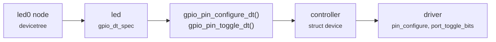

Blinky's `main.c` never says which pin the LED is on. This tour follows that
pin from the board's **devicetree**, through the GPIO **API**, to the
**driver** that sets it.



## The pin comes from devicetree

```tour
at: main.c:/gpio_pin_configure_dt/
highlight:
  - /define LED0_NODE/
  - /GPIO_DT_SPEC_GET/
dts:
  - /led0 = &led0/
  - /led0: led_0/ + 3
panel: gpio
```

`main()` is about to configure the LED's pin. It names the pin only through
`led`, a `struct gpio_dt_spec`: a GPIO controller, a pin number on it, and
flags. `GPIO_DT_SPEC_GET(LED0_NODE, gpios)` filled in all three when the
sample was built, from the board's devicetree. `LED0_NODE` is the node the
`led0` alias points at, and its `gpios` property holds the three values.

`gpio_is_ready_dt(&led)` has already checked that the controller was set up at
boot. Any board whose devicetree gives a GPIO LED the `led0` alias builds this
file unchanged.

## The pin arrives at the driver

```tour
at: gpio_virtio_pin_configure | qhg_pin_configure | gpio_esp32_config
watch:
  - controller = *$arg0 as string
  - pin = $arg1 as dec
  - flags = $arg2 as dec
panel: gpio
```

`gpio_pin_configure_dt()` handed the three values to `gpio_pin_configure()`,
which called this board's GPIO **driver**. The guest is paused at the top of
the driver's `pin_configure` function, and these are its arguments.

`controller` and `pin` are what devicetree chose. The controller is a
`struct device`, and its name comes from devicetree too.

The flags changed on the way. `GPIO_OUTPUT_ACTIVE` asks for the LED's active
state, whatever voltage that takes. `gpio_pin_configure()` turned it into a
voltage before calling the driver: high, because this LED is active-high.

## The device knows its driver

```tour
at: gpio_virtio_port_toggle_bits | qhg_port_toggle_bits | gpio_esp32_port_toggle_bits
when: first
watch:
  - pins = $arg1 as dec
  - api = device($arg0).api as ptr
memory:
  at: $arg0
  len: 32
  mark: 2p..3p
  note: api, the driver's table of functions
panel: led
```

The loop called `gpio_pin_toggle_dt(&led)`. The API turned the pin number into
a mask with that one bit set, `BIT(pin)`, and called the driver's
`port_toggle_bits`. `pins` is the mask.

How does the API find this function? The controller's `struct device` has an
`api` field, marked in the memory below, that points at the driver's table of
functions. `gpio_pin_configure()` called the table's `pin_configure`, and
this call went through its `port_toggle_bits`.

Every GPIO driver fills in the same table, so the API never needs to know
which driver it is calling.

## Toggle, print, sleep

```tour
at: main.c:/k_msleep/
when: first
highlight: /gpio_pin_toggle_dt/ + 7
panel: led
```

The pin was configured active, so the LED came on, and this first toggle
turned it off. `led_state` followed, and the terminal shows
`LED state: OFF`.

`k_msleep(SLEEP_TIME_MS)` puts `main` to sleep for a second. Then the loop
comes round: the same toggle, through the same table, once a second.

## What you saw

The LED's pin is chosen in devicetree, and the sample only names the `led0`
alias.

At build time, `GPIO_DT_SPEC_GET` copies the node's controller, pin and flags
into `led`. At run time, the GPIO API hands them to the controller's driver,
through the table of functions its `struct device` points at.

Pick another board in the top bar and this tour runs again there. Its
devicetree may name another controller and pin, with another driver behind
them, and `main.c` stays the same.
