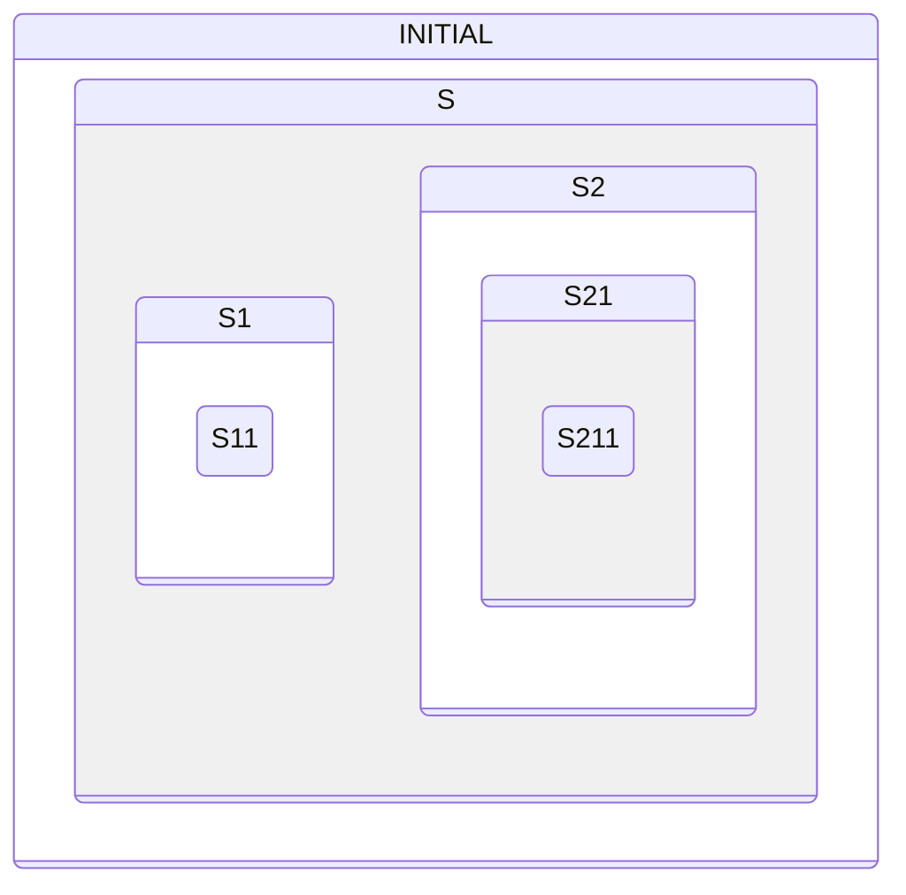

This sample runs the statechart from Figure 2.11 of Miro Samek's *Practical
UML Statecharts in C/C++* (PSiCC2) on Zephyr's State Machine Framework, SMF.
It is a hierarchical state machine: its states nest inside one another. One
thread runs it, handing each event to SMF, and the `hsm_psicc2 event` shell
command posts events A to I.



When states nest, more than one of them can respond to the same event. This
tour follows one event at a time to the state that handles it.

## Waiting in S211

```tour
at: hsm_psicc2_thread.c:hsm_psicc2_thread/k_msgq_get/ | hsm_psicc2_thread.c:316
when: first
watch:
  - current state = *smf_state(*smf_ctx(s_obj).current).run as code
highlight: /\[STATE_S21\] = SMF_CREATE_STATE/ + 3
```

The thread has started the machine and is about to wait for its first event.

`demo_states[]` is the whole statechart. Each row is one state: its entry, run
and exit functions, then its parent, then its initial child, where SMF goes
when a transition targets the state. S21 sits in S2 and starts in S211. S211
has no initial child: it is a leaf.

`smf_set_initial()` started at INITIAL and followed the initial children down
to a leaf, calling the entry function of every state on the way: INITIAL, S,
S2, S21 and S211. The card names a state by its run function, so the current
state reads `s211_run`.

Now `k_msgq_get()` waits for an event on `hsm_psicc2_msgq`, the queue the
shell command posts to. Continue, and the log prints the five entries.

## The innermost state goes first

```tour
at: s211_run
await: Post event G to the state machine.
do: hsm_psicc2 event G
when: hsm_psicc2_event(s_object(s_obj).event).event_id as u32 == 6
watch:
  - event_id = hsm_psicc2_event(s_object(s_obj).event).event_id as u32
  - current state = *smf_state(*smf_ctx(s_obj).current).run as code
highlight: /received EVENT_D", __func__/ + 8
```

The thread took G off the queue and passed it to `smf_run_state()`. SMF offers
an event to the current state first, so `s211_run()` sees it before any other
state: `event_id` 6 is `EVENT_G`.

S211 only has cases for D and H. For G it reaches
`return SMF_EVENT_PROPAGATE`, which means "not mine, pass it on".

## Its parent takes it

```tour
at: hsm_psicc2_thread.c:s21_run/STATE_S1\]/ | hsm_psicc2_thread.c:248
watch:
  - current state = *smf_state(*smf_ctx(s_obj).current).run as code
  - executing = *smf_state(*smf_ctx(s_obj).executing).run as code
```

SMF passed G up to S211's parent and called `s21_run()`. The context now holds
two different states: `current` is the state the machine is in, still S211,
and `executing` is the state whose function is running, S21.

S21 has a case for G, and it is about to call `smf_set_state()` to go to S1.
Asking for a transition ends the climb, even though `s21_run()` then returns
`SMF_EVENT_PROPAGATE`: S2, S and INITIAL never see this G. Part 2 follows what
the transition runs.

## Handled, and nothing moves

```tour
at: s1_run
await: Post event I.
do: hsm_psicc2 event I
when: hsm_psicc2_event(s_object(s_obj).event).event_id as u32 == 8
watch:
  - current state = *smf_state(*smf_ctx(s_obj).current).run as code
highlight: /received EVENT_I"/ + 1
```

G left the machine in S11, inside S1, so event I went to `s11_run()` first.
S11 has no case for it, so SMF passed it up to `s1_run()`, where this stop is.
S1 has a case for I, and it returns `SMF_EVENT_HANDLED`.

Handled means the event stops here and no state changes. `s_run()` has a case
for I as well, but it never sees this one, and `current` still names S11 when
`smf_run_state()` returns.

## Challenge: all the way up to S

```tour
at: s_run
await: "Challenge: from S11, post the one event that climbs all the way up to S. The log lists each run function it reaches."
ci: type hsm_psicc2 event E
when: hsm_psicc2_event(s_object(s_obj).event).event_id as u32 == 4
watch:
  - event_id = hsm_psicc2_event(s_object(s_obj).event).event_id as u32
  - current state = *smf_state(*smf_ctx(s_obj).current).run as code
  - executing = *smf_state(*smf_ctx(s_obj).executing).run as code
highlight: /case EVENT_E:/ + 3
```

E, `event_id` 4. Neither `s11_run()` nor `s1_run()` has a case for it, so it
climbed past both, to `s_run()`. S has one, and asks for S11.

From S11, no other event gets this far: S11 or S1 claims each of them. The
deeper a state, the earlier it gets its say.

## What you saw

SMF hands each event to the current state first, and climbs from there
through its parents. Each run function it calls does one of three things:

- Returns `SMF_EVENT_PROPAGATE`: the parent gets the event next.
- Returns `SMF_EVENT_HANDLED`: the event stops there, and the state stays the same.
- Calls `smf_set_state()`: the event stops there, and the machine moves.

So a parent only sees what its children pass up. The climb comes with
`CONFIG_SMF_ANCESTOR_SUPPORT`, which gives each state a parent; without it,
SMF calls the current state's run function alone.

One more to try: D. S11 acts on it only while the sample's `foo` flag is set,
and S1 only while it is clear. Post D twice and compare the two runs in the
log.

The framework is described in the Zephyr documentation:
[State Machine Framework](https://docs.zephyrproject.org/latest/services/smf/index.html).
