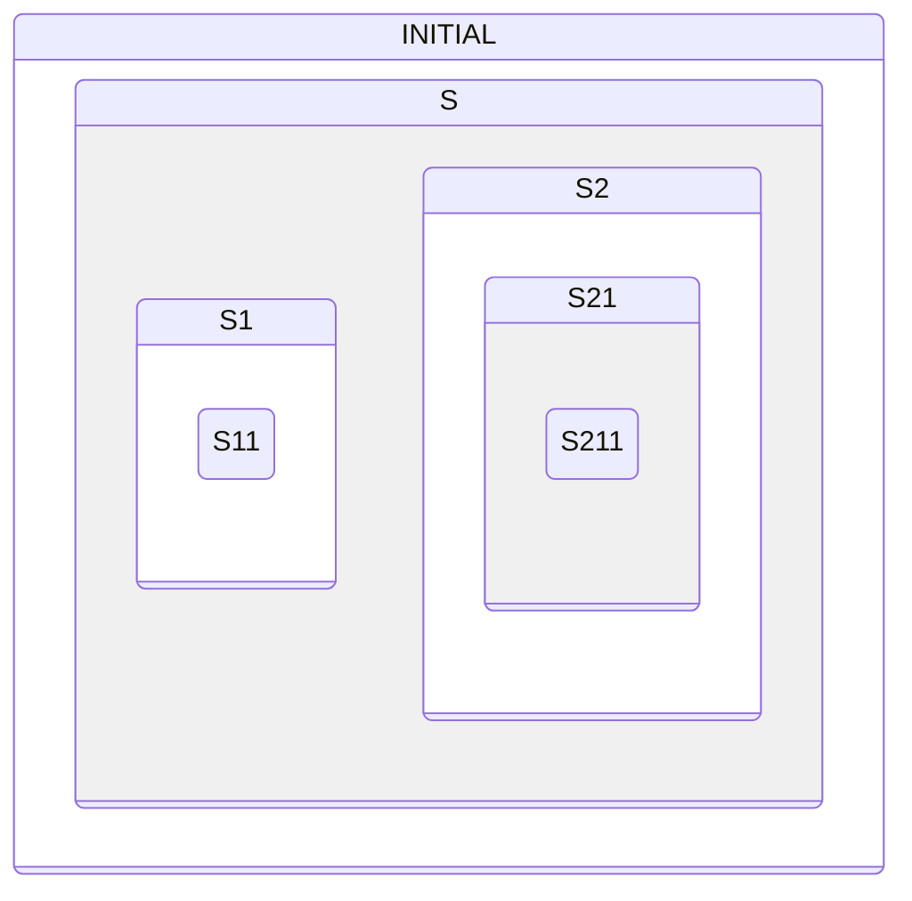

This sample runs the PSiCC2 statechart on Zephyr's State Machine Framework,
SMF, and the `hsm_psicc2 event` shell command posts events A to I to it.



Part 1 followed events up to the state that handles them. This tour follows
what happens when that state calls `smf_set_state()`: which states SMF leaves
and enters, and in what order.

## Out, from the inside

```tour
at: s211_exit
await: Post event G to the state machine.
do: hsm_psicc2 event G
when: hsm_psicc2_event(s_object(s_obj).event).event_id as u32 == 6
watch:
  - current state = *smf_state(*smf_ctx(s_obj).current).run as code
```

G climbed to S21, as in part 1, and `s21_run()` called `smf_set_state()` for
S1. SMF runs the whole transition inside that call, before `s21_run()` gets
control back.

It starts by leaving states, from the inside out. The first exit function is
S211's: S21 asked for the transition, but the machine is in S211, so S211 is
the first state to leave. The card names a state by its run function, and the
current state is still `s211_run`.

## Up to the common parent, not past it

```tour
at: s2_exit
highlight: /\[STATE_S1\] = SMF_CREATE_STATE/ + 3
```

`s21_exit()` ran, and this is the last exit: S2's. S1 is not inside S2, so the
machine has to leave S2 to get there. But S1 and S2 share a parent, S, and the
machine stays inside S, so SMF stops below it: `s_exit()` does not run, and
neither will `s_entry()`.

S is the least common ancestor: the innermost state that contains both the
state that called `smf_set_state()` and the target. Exits stop below it, and
entries start below it.

## In, and down to a leaf

```tour
at: s1_entry
watch:
  - current state = *smf_state(*smf_ctx(s_obj).current).run as code
  - previous state = *smf_state(*smf_ctx(s_obj).previous).run as code
  - executing = *smf_state(*smf_ctx(s_obj).executing).run as code
highlight: /\[STATE_S1\] = SMF_CREATE_STATE/ + 1
```

Now SMF enters states from the outside in, starting below S, so S1 comes
first. `executing` is S1, whose entry function is running.

But S1 is not a leaf. Before entering anything, SMF followed its initial
child, S11, and updated the context: `current` already names S11 and
`previous` names S211. S11's entry function runs next, and the transition is
done.

## Leaving to come back

```tour
at: s1_exit
await: Post event A.
do: hsm_psicc2 event A
when: hsm_psicc2_event(s_object(s_obj).event).event_id as u32 == 0
watch:
  - current state = *smf_state(*smf_ctx(s_obj).current).run as code
highlight: /case EVENT_A:/ + 3
```

S1 handled A by asking for S1 itself: a self-transition. `s11_exit()` has
run, and now S1 exits too, although it is the target. Then SMF enters S1
again, and S11 after it.

Compare event I in part 1: S1 handled it by returning `SMF_EVENT_HANDLED`, and
no exit or entry function ran. A transition to the state itself is different: it
runs the state's exit and entry functions again, which is how a state starts
over.

## Challenge: back to S211

```tour
at: hsm_psicc2_thread.c:hsm_psicc2_thread/if \(rc\)/ | hsm_psicc2_thread.c:322
await: "Challenge: the machine is in S11. Post one event that takes it back to S211."
# Not the A from the step before, which also comes back through here.
when: hsm_psicc2_event(s_object(s_obj).event).event_id as u32 != 0
ci: type hsm_psicc2 event F
watch:
  - current state = *smf_state(*smf_ctx(s_obj).current).run as code
check: *smf_state(*smf_ctx(s_obj).current).run as code == s211_run
pass: Back in S211. F targets S211 itself. C targets S2 and G targets S21, and SMF follows their initial children down to S211.
fail: Not there yet. From S11, an event goes to `s11_run()` and then `s1_run()`. Look for a case whose target is S211 or contains it, then post that event.
retry: yes
```

`smf_run_state()` has returned, and the check below reads the state the
machine ended up in. The exits and entries your event ran reach the log once
the guest runs again.

## What you saw

A transition leaves one branch of the hierarchy and enters another:

- Exits run from the current state outward, and stop below the least common ancestor of the state that called `smf_set_state()` and the target.
- Entries run from below that ancestor inward to the target, then on through initial children to a leaf.
- A transition to the state that asked for it exits and re-enters that state.
- `SMF_EVENT_HANDLED` without a transition runs no exit or entry function.

SMF updates `current` and `previous` only once the exits are done, so an exit
function still finds the state being left in `current`.

The framework is described in the Zephyr documentation:
[State Machine Framework](https://docs.zephyrproject.org/latest/services/smf/index.html).
