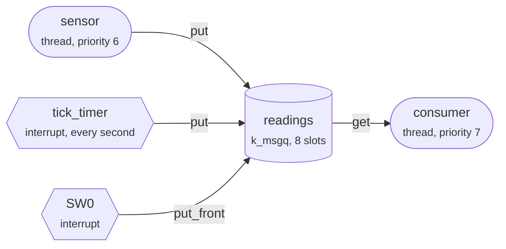

Part 1 looked inside a message queue that never filled up. This lab puts one
under load: three producers feed the queue `readings`, and one consumer thread
drains it.



The `msgq` shell command changes how each side behaves. You will fill the
queue, make the sensor wait, empty the queue under it, change who runs first,
and rescue an alarm. Some steps open **Trace**, which only the traced build has
(**Message Queue Lab · traced** in the app picker).

## The consumer asks first

```tour
at: main.c:consumer_thread/k_msgq_get\(&readings, &latest/ | main.c:182
when: first
threads: sensor, consumer
objects:
  type: msgq
  focus: readings
highlight: /K_MSGQ_DEFINE\(readings/
```

`K_MSGQ_DEFINE` set the queue up at build time: eight slots of 16 bytes, one
`struct reading` each, drawn here as a strip.

The consumer gets here first, because the sensor's loop starts with a sleep:
the thread list shows it sleeping. The consumer is about to call
`k_msgq_get()` with `K_FOREVER`, and the ring is empty, so it will wait.

## Straight into the consumer's buffer

```tour
at: z_impl_k_msgq_put
# A put to readings from a thread (CPU 0 is not in an interrupt): the sensor's.
when:
  - $arg0 == readings
  - _kernel as u32 == 0
threads: sensor, consumer
look: trace.ipc
watch:
  - consumer's buffer = _thread_base(k_thread(_k_thread_obj_consumer).base).swap_data as ptr
objects:
  type: msgq
  focus: readings
highlight: /pending_thread = z_unpend_first_thread_locked/ + 8
```

The sensor's first reading, inside the kernel. The thread list shows the
consumer waiting on `readings`, so `k_msgq_put()` is about to take the path
lit up below.

When a receiver is waiting, the kernel takes it off the queue's wait list and
copies the message straight into the buffer that receiver passed to
`k_msgq_get()`. The waiting thread's `swap_data` holds that buffer's address,
and here it is `latest`, the consumer's own variable. Then it makes the
consumer ready.

The ring is never touched: it stays empty, with R and W where they were. Most
readings in this lab go this way, because the consumer keeps up. As the lab
runs, **Trace → IPC** draws each one as a hollow ring on a depth line that
stays at 0. A queue only fills when its consumer falls behind.

## The queue fills up

```tour
at: main.c:sensor_thread/atomic_inc\(&dropped\)/ | main.c:168
await: Suspend the consumer, then watch the queue fill up.
do: msgq consumer suspend
look: trace.ipc
watch:
  - ticks lost = ticks_lost as u32
objects:
  type: msgq
  focus: readings
highlight: /Full and told not to wait/ + 1
```

With nothing taking readings out, all eight slots filled, and the sensor's
latest `k_msgq_put()` came back with `-ENOMSG`. Its timeout is `K_NO_WAIT`,
so the put did not wait for room. It failed at once, and the reading is
dropped.

R and W sit on the same slot. In a ring that means empty or full, and the
kernel tells the two apart with `used_msgs`: 8 of 8 here. The reading
numbered 1, the oldest, is the next one out.

`ticks lost` counts the timer's readings that met the same full queue. In
**Trace → IPC**, the depth has climbed to 8 and the drops count up.

## A thread can wait, an interrupt cannot

```tour
at: main.c:tick_expired/atomic_inc\(&ticks_lost\)/ | main.c:221
await: Make the sensor wait for room instead of dropping its readings.
do: msgq timeout forever
when: _thread_base(k_thread(_k_thread_obj_sensor).base).pended_on as ptr == k_msgq(readings).wait_q
threads: sensor, consumer, idle
objects:
  type: msgq
  focus: readings
highlight: /An interrupt handler cannot wait/ + 4
```

The sensor now puts with `K_FOREVER`. Its `k_msgq_put()` found no room and did
not fail: the kernel moved the thread onto the queue's wait list, where it
uses no CPU. The thread list shows it waiting on `readings`.

This stop is in the timer's expiry function, which runs in interrupt context:
the thread list shows `idle` running because that is the thread the tick
interrupted. An interrupt handler is not a thread, so there is nothing to put
to sleep. It may only use `K_NO_WAIT`, and `k_msgq_put()` asserts as much in
a build with assertions on. This tick met the same full queue and was lost.

Same queue, same moment, two outcomes. A timeout belongs to each call, not to
the queue.

## Purged while waiting

```tour
at: main.c:sensor_thread/atomic_inc\(&purged_waiters\)/ | main.c:165
await: Now empty the queue while the sensor is still waiting.
do: msgq purge
objects:
  type: msgq
  focus: readings
highlight: /It was waiting for room/ + 1
```

`k_msgq_purge()` threw away the eight readings and woke every thread waiting
on the queue with `-ENOMSG`. The sensor's `k_msgq_put()` with `K_FOREVER` has
just returned that error, and the reading it was holding never went in.

Purging does not clear the buffer. It sets `used_msgs` to 0 and moves R up to
W, so the ring reads empty from wherever the two pointers stood.

So even a call that waits forever can come back early. Code that uses
`K_FOREVER` still checks what the call returns.

## A slow consumer sets the pace

```tour
at: msg_q.c:z_impl_k_msgq_get/add the sender's pending message/ | msg_q.c:368
await: Slow the consumer to a second per reading, then let it run again.
do:
  - msgq work 1000
  - msgq consumer resume
look: trace.ipc
watch:
  - sensor's reading = _thread_base(k_thread(_k_thread_obj_sensor).base).swap_data as ptr
objects:
  type: msgq
  focus: readings
highlight: /add the sender's pending message/ + 13
```

The consumer is back, but it now spends a second on each reading while about
three arrive every second. The queue stays full, and the sensor spends most
of its time waiting in `k_msgq_put()`.

This is the other side of step 2, inside `k_msgq_get()`. The consumer has
just taken the oldest reading out, freeing one slot: 7 of 8 used, with W on
the free slot. Before it returns, the kernel finds the sensor on the wait
list, copies the sensor's reading into that slot and wakes the sensor with
success. Until now the reading sat on the sensor's own stack, which is where
its `swap_data` points.

That is backpressure: the sensor slows to the consumer's pace and loses
nothing. The timer, which cannot wait, still loses ticks. In
**Trace → IPC** the depth holds at 8.

## Priority decides who runs next

```tour
at: main.c:consumer_thread/atomic_inc\(&delivered\)/ | main.c:189
await: Start the lab over, then raise the consumer above the sensor.
do:
  - msgq reset
  - msgq prio 5
# The sensor is ready (128 is _THREAD_QUEUED alone, not sleeping or waiting),
# and the consumer is holding one of its readings (FROM_SENSOR is 0).
when:
  - _thread_base(k_thread(_k_thread_obj_sensor).base).thread_state as u8 == 128
  - reading(latest).source as u32 == 0
look: trace.timeline
threads: sensor, consumer
highlight: /k_msgq_get\(&readings, &latest/
```

The consumer now runs at priority 5 and the sensor at 6. In Zephyr the lower
number is the higher priority.

Look at the sensor in the thread list: it is ready, not sleeping, because it
is still inside `k_msgq_put()`. That put handed its reading to the waiting
consumer, as in step 2, and the kernel then rescheduled. The consumer
outranks the sensor, so it took the CPU on the spot, and its
`k_msgq_get()` returned before the sensor's `k_msgq_put()` did.

At the default priority of 7, the same hand-off only makes the consumer ready,
and it runs once the sensor goes back to sleep. **Trace → Timeline** records
each of these switches in the two threads' lanes.

## An alarm with nowhere to go

```tour
at: main.c:raise_alarm/atomic_inc\(&alarms_lost\)/ | main.c:247
await: Suspend the consumer, give the queue a few seconds to fill, then press **SW0** in **Buttons**.
do: msgq consumer suspend
ci:
  - wait 5s
  - press sw0
panel: keys
watch:
  - put_front returned = alarm_err as i32
  - raised in an interrupt = alarm_in_isr as bool
objects:
  type: msgq
  focus: readings
highlight: /An alarm jumps the line/ + 3
```

SW0's interrupt handler called `raise_alarm()`, which puts the alarm at the
front of the queue with `k_msgq_put_front()`, so that it is read next. But the
queue is full, and `k_msgq_put_front()` has no timeout: it never waits. It
returned `-ENOMSG` (-35), and the alarm is gone.

An alarm is the one reading you cannot afford to lose, and its interrupt
handler cannot wait for room. So the decision has to be made before the
queue is full: what gives way when an alarm arrives?

That is the challenge on the next card.

## Challenge: save the next alarm

```tour
at: main.c:raise_alarm/if \(alarm_err != 0\)/ | main.c:246
await: "Challenge: get the next alarm into the full queue while the consumer stays suspended, then press **SW0**."
ci:
  - type msgq policy drop-oldest
  - wait 1s
  - press sw0
panel: keys
check:
  - alarm_err as i32 == 0
  - evicted as u32 > 0
pass: The alarm is in. The oldest reading made room, and the alarm took the slot at the front of the line.
fail: Not this time. With the consumer suspended, something already in the queue has to give way; see what `msgq policy` offers, then press SW0 again.
retry: yes
objects:
  type: msgq
  focus: readings
highlight: /The drop-oldest policy makes room/ + 4
```

`raise_alarm()` has just called `k_msgq_put_front()`, and the check below
reads what it returned. `evicted` counts the readings a policy threw out to
make room.

Resuming the consumer or purging the queue would also make room, but both
change the whole system to save one message. A policy decides ahead of time,
in the producer, what an alarm may push out.

When the alarm gets in, look at the ring: it sits on R, the next slot to be
read, although it is the newest reading in the queue.

## What you saw

Most of a message queue's behaviour is in the paths around its ring:

- A put to an empty queue with a waiting receiver skips the ring and copies straight into the receiver's buffer. A get from a full queue with a waiting sender refills the freed slot from that sender.
- The timeout belongs to each call. `K_NO_WAIT` fails at once, `K_FOREVER` waits, and even `K_FOREVER` returns `-ENOMSG` when the queue is purged. Interrupt handlers only get `K_NO_WAIT`.
- Priority decides whether a hand-off switches threads on the spot.
- `k_msgq_put_front()` never waits. A producer that must not lose a message needs a plan for a full queue before the queue is full.

`msgq stat` shows every counter, `msgq verbose on` logs each reading the
consumer takes, and `msgq reset` starts over. The kernel's own description is
in the Zephyr documentation:
[Message Queues](https://docs.zephyrproject.org/latest/kernel/services/data_passing/message_queues.html).
