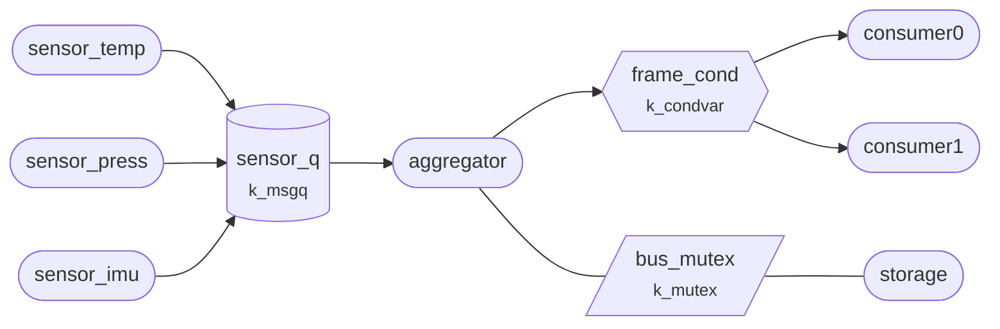

Every fourth reading, the aggregator publishes a frame, a summary of the
readings so far, for two consumer threads.



This tour is about how the consumers find out: they wait on a condition
variable, and the aggregator wakes them.

## Two consumers wait for a frame

```tour
at: main.c:/k_mutex_lock\(&frame_mutex/ | main.c:172
when: first
highlight: /while \(published_frame.seq == last_seen\)/ + 2
threads: aggregator, consumer*
```

The aggregator is about to write the first frame to `published_frame`, where
the consumers read it.

In the thread list, both consumers are waiting on `frame_cond`, a **condition
variable**: a place where threads sleep until another thread tells them that
some shared data has changed. Here, that data is `published_frame`.

## One broadcast wakes both

```tour
at: main.c:/k_mutex_unlock\(&frame_mutex\)/ | main.c:177
when: first
highlight: /k_condvar_broadcast/
watch:
  - published_frame.seq = frame(published_frame).seq as u32
threads: aggregator, consumer*
```

The aggregator wrote frame 1 to `published_frame` and called
`k_condvar_broadcast()`, which wakes every thread waiting on `frame_cond`.
Both consumers are ready to run now. `k_condvar_signal()` would have woken
only one of them.

## Back from the wait, holding the mutex

```tour
at: main.c:/f = published_frame;/ | main.c:244
when: first
highlight: /Wait for a frame we have not processed yet/ + 4
objects:
  type: mutex
  focus: frame_mutex
```

This consumer is back from `k_condvar_wait()`, and the mutex list shows it
owns `frame_mutex` again. The wait released the mutex while the consumer
slept, which let the aggregator take it to publish, and locked it again
before returning.

So the consumer copies the frame knowing that nobody is writing it.

## What you saw

A condition variable lets a thread sleep until another thread says that
shared data has changed. The data stays in your own variables, guarded by a
mutex that the wait releases and takes back. The condition variable carries
no data itself, which is why each consumer checks `published_frame.seq` in a
loop before it uses the frame.
