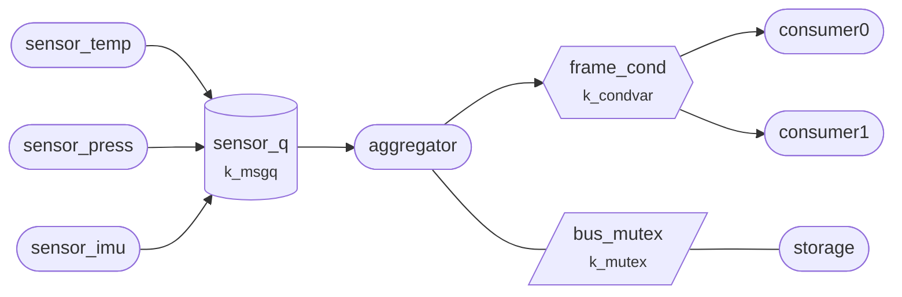

This sample is a small sensor application. Three sensor threads take readings
at their own pace and hand them to an aggregator thread, which summarises them
for two consumer threads. A storage thread shares a bus with the aggregator.

This tour follows one reading from a sensor to the aggregator. The two threads
never share a variable: a message queue carries the reading from one to the
other.

## The aggregator waits for a reading

```tour
at: main.c:/k_msgq_get\(&sensor_q/ | main.c:207
when: first
highlight: /K_MSGQ_DEFINE\(sensor_q/
objects:
  type: msgq
  focus: sensor_q
  view: list
```

This app is a small sensor pipeline. Three sensor threads take readings and
pass them to an aggregator thread through `sensor_q`, a **message queue**.
`K_MSGQ_DEFINE` set it up at build time: room for 16 messages of 12 bytes, one
`struct sensor_reading` each.



The aggregator is about to call `k_msgq_get()`, and no sensor has run yet, so
the queue is empty. With `K_FOREVER`, the call waits as long as it takes: the
aggregator sleeps here, using no CPU, until a reading arrives.

## A sensor sends a copy

```tour
at: main.c:/k_msgq_put\(&sensor_q/ | main.c:154
when: first
highlight: /struct sensor_reading r = \{/ + 4
threads: aggregator, sensor*
```

A sensor thread has filled in `r`, a reading on its own stack, and is about to
pass its address to `k_msgq_put()`. The call copies the 12 bytes. Once it
returns, `r` is the sensor's to reuse, and the next pass of the loop
overwrites it.

The thread list shows the other side: `aggregator` is waiting on `sensor_q`.

## Back for the next one

```tour
at: main.c:/k_msgq_get\(&sensor_q/ | main.c:207
when: first
highlight: /agg_sum \+= r.value/ + 3
watch:
  - agg_count = agg_count as u32
```

`k_msgq_get()` returned with the reading copied into the aggregator's own `r`.
The aggregator added it to its running totals (`agg_count` is now 1) and came
straight back to `k_msgq_get()` for the next one.

That loop is the usual shape of a thread that consumes messages: wait, take
one, handle it, wait again.

## Three sensors, one queue

```tour
at: main.c:/k_msgq_get\(&sensor_q/ | main.c:207
when: hits == 9
stop: no
look: trace.queues
```

The guest keeps running from here. In **Trace → Queues**, `sensor_q` has three
senders and one receiver. Each sensor puts a reading at its own period (23, 37
and 53 ms), and the aggregator takes them in the order they arrived.

No sensor knows about the aggregator, or about the other sensors. Each one
only knows the queue, so a fourth sensor could be added without changing the
aggregator.

## What you saw

A `k_msgq` passes fixed-size messages between threads by copying them. The
receiver sleeps in `k_msgq_get()` until there is something to take, and a
sender only needs to know the queue, not who reads from it.
