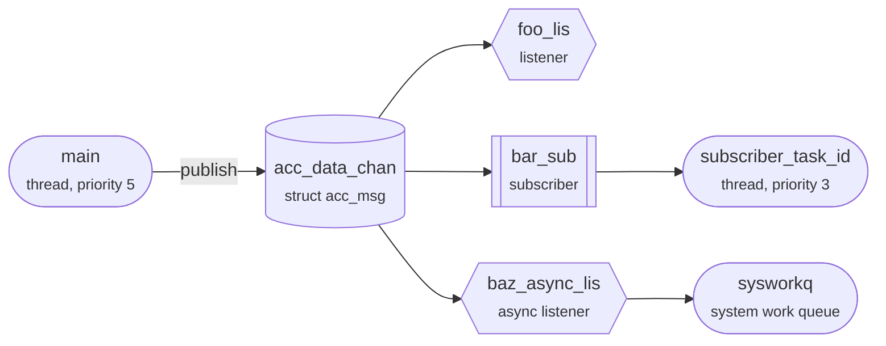

This is zbus's Hello World sample. zbus, the Zephyr bus, lets threads share
data without knowing about each other: a thread publishes a message on a
**channel**, and zbus hands it on to the channel's **observers**.

The sample defines three channels. `acc_data_chan` carries an accelerometer
reading and has three observers, one of each main kind: a listener, a
subscriber and an async listener. `simple_chan` holds an `int` and accepts
only 0 to 9. `version_chan` holds a version number that nobody publishes.



`main()` publishes twice on `acc_data_chan`, a second apart, then tries two
values on `simple_chan`. This tour follows the first publish from start to
finish, then watches `simple_chan` turn a value away.

## A channel is a message, a lock and a list

```tour
at: main.c:main/zbus_chan_pub\(&acc_data_chan, &acc1,/
highlight: /ZBUS_CHAN_DEFINE\(acc_data_chan/ + 7
watch:
  - 1st observer = zbus_channel_observation(acc_data_chan00).obs as ptr
  - 2nd observer = zbus_channel_observation(acc_data_chan01).obs as ptr
  - 3rd observer = zbus_channel_observation(acc_data_chan02).obs as ptr
memory:
  at: _zbus_message_acc_data_chan
  len: 12
  note: the channel's message, a struct acc_msg
```

`main()` is about to publish its first reading, x, y and z all 1.

`ZBUS_CHAN_DEFINE` set up three things at compile time: the message itself, a
`struct acc_msg` that zbus keeps for the channel (still all zeros, under the
values); a semaphore that guards it; and the observers named in
`ZBUS_OBSERVERS()`.

The observer list is not stored in the channel. Each channel and observer pair is a
small constant in a linker section, and the linker sorts the section by name:
`acc_data_chan00`, `acc_data_chan01`, `acc_data_chan02`. So one channel's
observers sit together, in the order you wrote them. The three values above
are read from those pairs.

Channels and observers have sorted sections of their own, which is why the
channel list the sample printed at startup is in alphabetical order.

## Publishing takes the lock, then copies

```tour
at: zbus.c:zbus_chan_pub/memcpy\(chan->message, msg/
highlight:
  - /chan->validator != NULL/ + 2
  - /err = chan_lock\(chan, timeout/ + 3
watch:
  - lock = k_sem(zbus_channel_data(_zbus_chan_data_acc_data_chan).sem).count as u32
```

This stop is inside zbus, in `zbus_chan_pub()`.

First comes the validator, for a channel that has one: `acc_data_chan` has
none. Then `chan_lock()` takes the channel's semaphore. Its count was 1, free,
and now reads 0: `main` holds the channel. A thread that wants it now has to
wait, for as long as the timeout it passed allows.

With the lock held, `memcpy()` copies the whole message over the channel's,
so a reader never sees half an update. Next, `_zbus_vded_exec()` tells each
observer, and only then does `chan_unlock()` give the semaphore back.

## A listener runs inside the publish

```tour
at: listener_callback_example
highlight: /ZBUS_LISTENER_DEFINE\(foo_lis/
watch:
  - returns to = $lr as code
  - lock = k_sem(zbus_channel_data(_zbus_chan_data_acc_data_chan).sem).count as u32
memory:
  at: _zbus_message_acc_data_chan
  len: 12
  note: x, y and z, now 1
threads: main
```

`foo_lis` is first in the list, and it is a listener: `ZBUS_LISTENER_DEFINE`
gave it a callback, and zbus calls it straight away.

`returns to` is the address the CPU saved when zbus called this function, so
it says who the caller is: `_zbus_vded_exec()`, which `zbus_chan_pub()` calls
to tell each observer in turn. The thread list shows `main` running. A
listener runs in the publisher's thread, inside the publish, with the channel
still locked: the lock reads 0. That is what makes `zbus_chan_const_msg()`
safe here: it points at the channel's own message, without a copy, and nobody
can change that message while the lock is held.

It also means a listener holds everyone up: the observers after it, and
`main()` itself. Keep listeners short, and never let one wait.

## A subscriber gets the channel, not the message

```tour
at: z_impl_k_msgq_put
when:
  - $arg0 == _zbus_observer_queue_bar_sub
  - first
highlight: /pending_thread = z_unpend_first_thread_locked/ + 6
watch:
  - message = $arg1 as ptr
objects:
  type: msgq
  focus: _zbus_observer_queue_bar_sub
threads: main, subscriber_task_id
```

`bar_sub` is a subscriber. `ZBUS_SUBSCRIBER_DEFINE(bar_sub, 4)` gave it a
message queue with four slots, drawn here, and the sample's
`subscriber_task_id` thread waits on that queue in `zbus_sub_wait()`.

So telling a subscriber is a `k_msgq_put()`, and this stop is in the kernel,
inside it. Look at the message being sent: not the reading, but
`acc_data_chan`. A subscriber's queue holds channel addresses, 8 bytes each
however big the message is. The subscriber learns which channel changed, and
reads the message itself, later.

The thread list shows `subscriber_task_id` waiting, so the kernel skips the
slots, copies the address straight to the waiting thread, and makes it ready
to run.

## The subscriber wakes up, and waits for the lock

```tour
at: zbus.c:zbus_chan_read/k_sem_take/
when: first
watch:
  - lock = k_sem(zbus_channel_data(_zbus_chan_data_acc_data_chan).sem).count as u32
threads: main, subscriber_task_id
```

`subscriber_task_id` has priority 3, and `main` has 5. In Zephyr a lower
number is a higher priority, so as soon as the put made the subscriber ready,
the scheduler switched to it, in the middle of `main()`'s publish. The thread
list shows `main` ready, not running.

`zbus_sub_wait()` handed it `acc_data_chan`, and the subscriber now calls
`zbus_chan_read()` to copy the message out. Reading takes the same lock as
publishing, and the lock still reads 0: `main` holds it, with one observer
left to tell. So the subscriber waits, and `main` gets the CPU back.

## The async listener works on a copy

```tour
at: async_listener_callback_example
highlight: /ZBUS_ASYNC_LISTENER_DEFINE\(baz_async_lis/
watch:
  - message = $arg1 as addr
  - lock = k_sem(zbus_channel_data(_zbus_chan_data_acc_data_chan).sem).count as u32
memory:
  at: $arg1
  len: 12
  note: the copy this callback reads
threads: main, subscriber_task_id, sysworkq
look:
  - trace.queues
  - trace.zbus
```

The last observer, `baz_async_lis`, is an async listener: a callback, like a
listener, that zbus runs later, from a work queue. Here that is the system
work queue, whose thread `sysworkq` runs ahead of every other thread here
(priority -1).

Before telling anyone, zbus copied the message into a buffer from the system
heap. For an async listener it puts that buffer in the listener's FIFO and
submits the listener's work item. The callback reads the copy, not the
channel: the lock still reads 0, held by `main`, and this callback never needs
it. A later publish cannot change what it is reading, either.

`main` is still in its publish, and the subscriber is still waiting for the
lock. On the traced build, **Trace → zbus** draws this moment at its right
edge: the publish still open on `acc_data_chan`, `foo_lis`'s callback done,
`bar_sub`'s thread woken and waiting in its read, and this callback running in
`sysworkq`.
**Trace → Queues** shows what zbus built for these observers, under the names
it gave them: the subscriber's queue, this listener's FIFO, and the pool the
message buffers come from.

## A validator turns a value away

```tour
at: simple_chan_validator
when: $arg0 as i32 == 15
highlight:
  - /\(\*simple >= 0\) && \(\*simple < 10\)/
  - /ZBUS_CHAN_DEFINE\(simple_chan/ + 6
watch:
  - value = $arg0 as i32
  - simple_chan holds = _zbus_message_simple_chan as i32
  - lock = k_sem(zbus_channel_data(_zbus_chan_data_simple_chan).sem).count as u32
```

Both publishes on `acc_data_chan` are done, and the terminal shows each
observer's line. Now `main()` publishes on `simple_chan`, whose
`ZBUS_CHAN_DEFINE` names a validator: `simple_chan_validator()` accepts 0 to 9.

The first value, 5, passed, and `simple_chan` still holds it. This stop is the
second try, 15. `zbus_chan_pub()` asks the validator before it takes the lock,
so the lock is free, nothing has been copied, and no observer will hear of
it. The validator returns `false`, and `zbus_chan_pub()` returns `-ENOMSG`.

## What you saw

A zbus channel is a message, a semaphore and a list of observers fixed at
build time. Publishing locks the channel, copies the message in, tells every
observer in order, and unlocks.

Each kind of observer hears about it differently:

- A **listener** runs inside the publish, in the publisher's thread, with the channel locked.
- A **subscriber** gets the channel's address in its own queue, and reads the message later, under the lock.
- An **async listener** gets a copy of the message, and runs from a work queue.

That is the order of the lines in the terminal: listener, async listener,
subscriber. The subscriber was second in the list and woke up before the
async listener ran, but it could not read until `main` had told everyone and
released the lock.
